# Auralis

**简体中文** | [English](README_EN.md)

Auralis 是一个本地优先的 AI 广播剧生产工作台，可将小说等叙事文本转换为可编辑的广播剧项目。它将原文改编、人物设计、台本审查、音色分配、TTS 生成、音频版本管理和项目播放整合在一套桌面工作流中。

项目以完整生产闭环、清晰状态管理和可恢复的 AI 步骤为重点。用户可以在音频生成前检查并修正每一项关键输出，而不是接受一次性生成的黑盒结果。

快速入口：[在线体验](#在线体验) · [图文使用教程：0907 便利店](#tutorial-0907) · [本地运行](#本地运行) · [常见问题](#tutorial-faq)

文档导航：[产品范围](PROJECT.md) · [当前架构与调用链](docs/project-map.md) · [开发约定](AGENTS.md) · [验收与剩余项](BACKLOG.md)

## 在线体验

[▶ 体验《雨夜来件》导演 Demo](https://rheeh.github.io/auralis/#/demo)

原创都市悬疑短篇，约 46 秒真实成片。可以修改台词、对比同音色的有/无导演指导版本、试听 6 个候选声音、把音效加到指定台词附近并导出立体声 WAV。预置 22 个真实合成 take，无需配置后端或 API Key。修改文本后会提示重新配音，不冒充实时生成。

本地前端也可直接访问 `/#/demo`；`scripts/seed_director_demo.py` 可将相同素材导入独立制作工程。提示词评测仅允许 `qwen3.8-27b` / `kimi-k3`，实测与限制见[实验报告](evals/audio_drama_v2/REPORT.md)。[演示与验收记录](docs/demo-2026-09-05.md)包含操作路径与复现方法。

## 核心能力

- 将小说原文转换为“原文分析 → 人物草稿 → 台本初稿 → 独立审查 → 用户确认 → 正式写入”的广播剧工作流。
- 草稿与正式项目数据分离；用户确认前，不完整的 AI 输出不会污染生产数据。
- 显式展示台本迭代：初稿可先出现，随后呈现审查结果和返修版本，不把等待过程隐藏在黑盒中。
- 内置常驻制作助手，可处理修改场景、定位台词、更换音色、重新生成音频和检查缺失音频等自由指令。
- 支持定向返修，将反馈定位到相关人物、场景或台词，而不是盲目重跑整个流程。
- 随台本生成可审阅的整场表演设计，统一人物意图、表演推进和逐句接话关系；支持项目级作品背景、共同表演基调、发音词表，以及逐句生成输入预览和历史请求记录，详见[配音设定与排查](docs/speech-direction.md)。
- 逐句保存生成音频版本；重新生成不会覆盖旧版本，可选择当前用于播放和导出的版本。
- 内置 CC0 环境声、拟音与背景音乐素材，支持标签检索、试听、上传，以及一键加入任意台词前后/同时，调整音量与淡入淡出。
- 提供持久化四轨时间线，可调整片段时间、时长、增益、淡入淡出和静音状态，并通过 FFmpeg 渲染章节 WAV。
- 明确展示 TTS 能力差异：云端模型可接收更丰富的声音指导；Edge-TTS 将指导近似映射为语速、音高和音量。
- 在单一项目工作台中完成原文、人物、台词、音色、生成队列、音频试听、连续播放和项目检查。

## 典型流程

1. 将小说原文粘贴给制作助手。
2. 确认或修改识别出的人物。
3. 生成第一版广播剧台本。
4. 由独立审查步骤检查旁白叙事功能、听觉因果和关键事实等问题，不按统一旁白比例删稿。
5. 查看返修台本，并通过制作助手进行定向修改。
6. 将确认后的台本写入正式项目。
7. 分配人物音色，生成和比较逐句音频版本。
8. 在时间线上编排对白、旁白、音效和音乐，渲染并下载章节成片。

<a id="tutorial-0907"></a>

## 图文使用教程：以「0907 · 便利店」为例

下面以 **2026 年 9 月 7 日的本地真实项目「0907」** 演示操作。章节原文以“晚上十点半，雨突然下大了。”开头，场景为“便利店雨夜”，两位发声人物是林晚和便利店店员。图片中的橙色编号对应下方操作说明，点击图片可查看原图。

截图时，这个章节已有 **542 字原文、48 行多轨台本、35/35 条人声配音、42 个时间线片段**；仍有 6 行音效/BGM 没有音频，已有约 72 秒的**阶段成片**。这些是示例当时的状态，不是新项目必须达到的数量。项目列表的“4 个角色”还包括音效/BGM 条目；人物卡中的实际发声人物为 2 人。

「0907」的工程数据和生成音频保存在本地，不随仓库分发。新安装的用户可以按下文创建自己的项目；无需配置的试听入口是上方《雨夜来件》Demo。

| 想完成的事 | 本节入口 |
| --- | --- |
| 首次配置、创建或继续项目 | [1. 启动与项目入口](#tutorial-start) |
| 输入故事，理解五个制作视图 | [2. 原文与改编要求](#tutorial-source) |
| 确认人物、挑选声音、审阅台本 | [3. 人物与台本](#tutorial-script) |
| 生成、试听、修改某一句 | [4. 配音与音频版本](#tutorial-voices) |
| 补雨声、开门声或背景音乐 | [5. 音效与 BGM](#tutorial-sound) |
| 调整入场时刻、循环和倍速 | [6. 声音编排](#tutorial-timeline) |
| 试听混音并下载 WAV | [7. 导出章节成片](#tutorial-export) |

<a id="tutorial-start"></a>

### 1. 启动与项目入口

在仓库根目录执行以下命令，并保持终端运行。首次启动会安装后端依赖；详细环境要求见[本地运行](#本地运行)。

```bash
./scripts/dev.sh
```

浏览器打开 [本地 Auralis](http://127.0.0.1:5173)，点击“开始创作”进入项目列表。

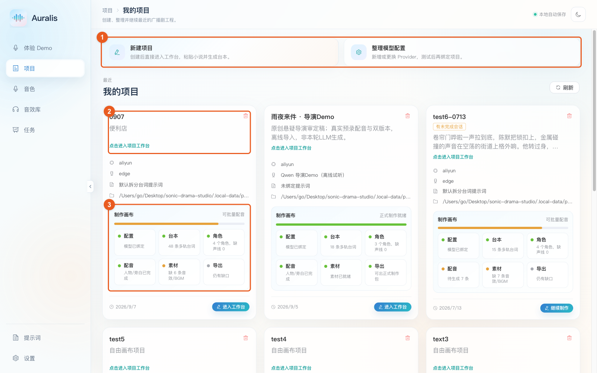

1. **首次使用：先配置，再新建。** 从图中 ①“整理模型配置”进入设置；也可从侧栏“设置 → 从向导配置 → 正式制作”依次完成改编模型、配音方式与保存位置。已有可用配置时直接点击“新建项目”。
2. **继续现有项目：点击 ②「0907」。** 点击卡片或“进入工作台”都会进入该项目，无需重新粘贴原文。
3. **用 ③ 制作画布检查缺口。** 配置、台本、角色、配音、素材和导出分别反映不同进度。“人物/旁白已完成”不代表音效和 BGM 也完成；本例的素材格仍显示“缺 6 条音效/BGM”。

首次配置时，区分以下两类服务：

| 配置项 | 用途 | 怎么检查 |
| --- | --- | --- |
| LLM 提供商与模型 | 解析原文、设计人物、改编和审查台本、响应制作助手 | 在“LLM 管理”配置 Base URL、API Key、模型列表并启用；向导可测试改编能力 |
| TTS 引擎与角色音色 | 将台词合成为声音 | 在“TTS 管理”配置引擎，再到“音色”管理声音；在人物卡中试听并绑定 |

新建项目时填写名称（例如“我的便利店广播剧”）和可选备注，展开“高级设置：模型、TTS、提示词和保存位置”，检查 LLM 提供商、LLM 模型和 TTS 引擎后创建。使用自己的可用服务配置；截图中的音色和额度提示取决于本机配置与账户，不是所有账户的默认权益。

**实际每句使用的 TTS，以配音页的“实际配音”一栏为准。** 例如本例项目卡片显示默认引擎 `edge`，但两位人物已绑定云端音色，台词实际使用 `qwen-audio-3.0-tts-plus`。

<a id="tutorial-source"></a>

### 2. 原文与改编要求

进入工作台后，先认识顶部导航：**原文 → 人物与台本 → 配音 → 声音编排 → 导出**。所有视图属于同一个章节。

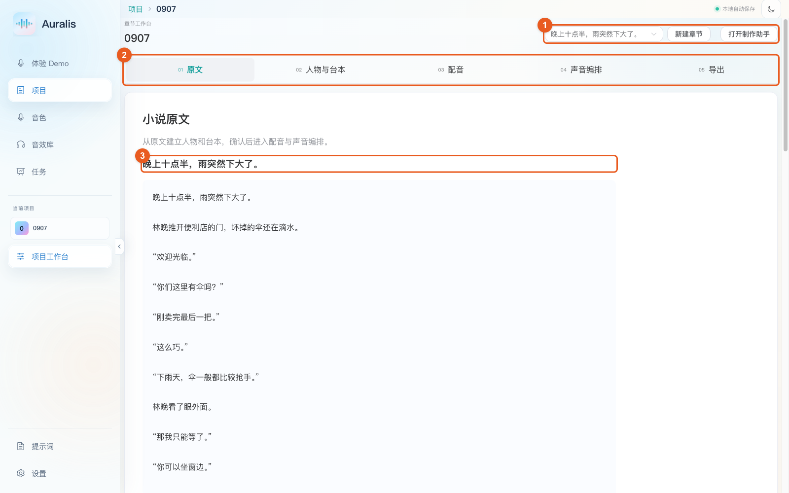

1. **① 当前章节与助手入口：** 下拉切换章节；“新建章节”开启下一次改编；“打开制作助手”展开对话区。
2. **② 五个视图：** 新项目会随制作进度解锁后续视图；已有项目可以直接进入配音或声音编排。
3. **③ 已保存原文：** 本例标题为“晚上十点半，雨突然下大了。”，可随时回到这里核对情节与台词。

从零开始时，在“原文”页填写章节标题、粘贴小说正文，再写改编要求：

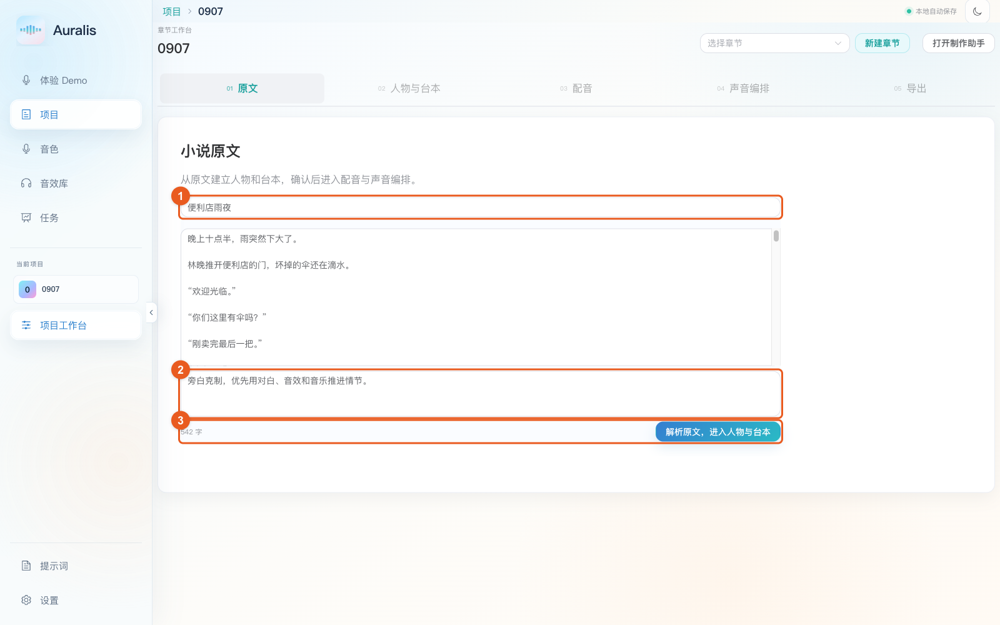

图中 ① 是可选标题，② 是改编要求，③ 显示字数并提交解析。例如：

```text
旁白克制，优先用对白、音效和音乐推进情节。
保留林晚和便利店店员的轻松调侃；对白自然，不要播音腔。
雨声作为环境铺底，开门和门铃用音效交代。
```

点击“解析原文，进入人物与台本”，等待人物草稿出现。**这张输入图是使用「0907」原文做的未提交填写示范；教程截图没有重复运行改编。**

<a id="tutorial-script"></a>

### 3. 确认人物、选择音色，再审阅台本

**新改编的第一处确认是人物。** 检查人物是否遗漏、身份与说话方式是否合理，并为每位选中的人物绑定独立音色；满意后点击“人物设定满意，生成台本”或助手区的“确认人物并生成台本”。

本例已经完成确认，可从“人物与台本 → 人物卡”查看：

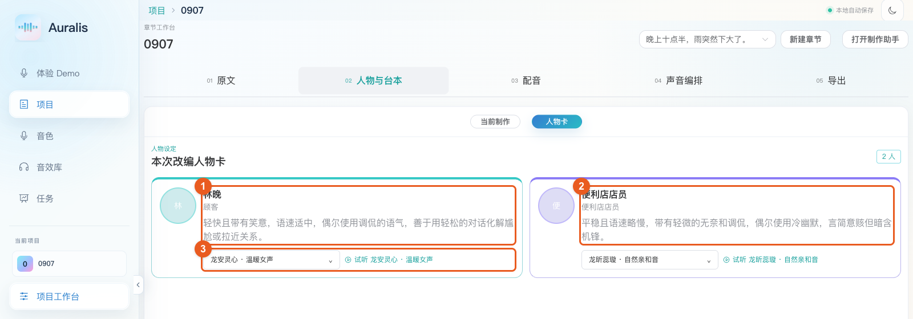

- **① 林晚：** 顾客，轻快且带笑意，用调侃拉近关系。
- **② 便利店店员：** 表达平稳、稍慢，带一点无奈和冷幽默。
- **③ 角色音色：** 点击当前音色展开选择器；旁边的试听按钮播放已有参考音频。

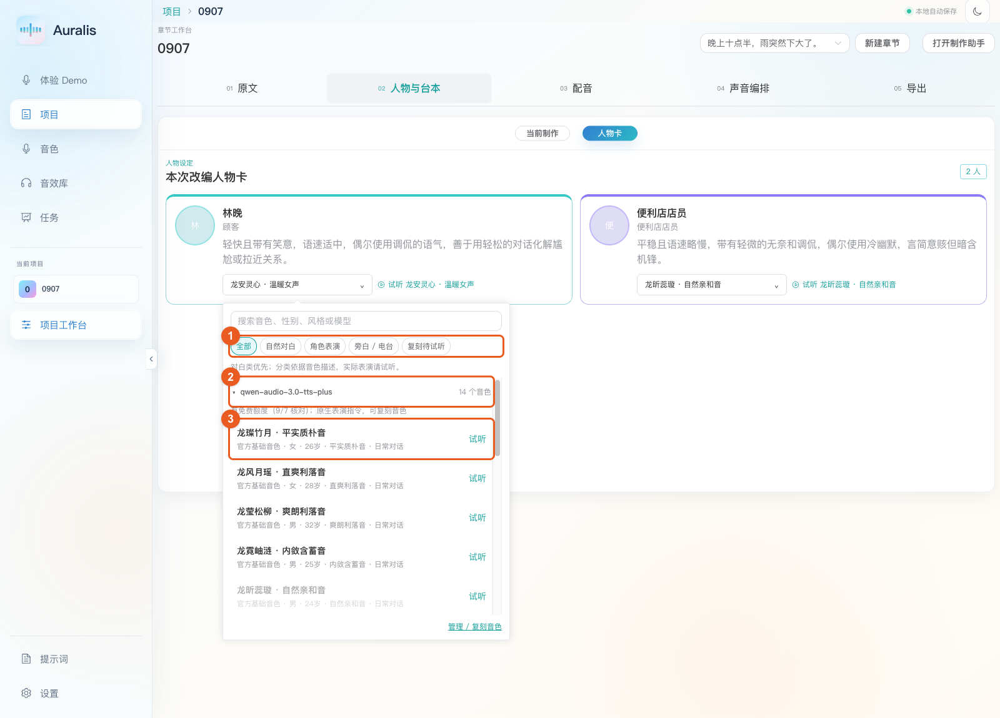

1. 用 ①“自然对白”“角色表演”等筛选缩小范围，也可以搜索音色、风格或模型。
2. 展开 ② 模型分组查看候选声音。不同模型的音色不能仅凭同名互换。
3. 在 ③ 先点右侧“试听”，再点候选名称绑定。**试听不会更换角色音色；点击候选名称会更新绑定。** 已被另一位人物使用的音色不可重复选择。

**第二处确认是台本。** 生成人物之后，系统会给出初稿、进行独立审查，并在需要时返修。新改编应等到确认按钮可用，再逐场检查：

| 检查什么 | 「0907」中的例子 |
| --- | --- |
| 台词是否属于正确人物 | “欢迎光临。”由便利店店员说，“你们这里有伞吗？”由林晚说 |
| 视觉与动作是否能被听见 | 推门、门铃、雨声应成为可制作的声音提示 |
| 纯朗读文本是否干净 | “轻笑、压低声音”等写在声音指导里，不让 TTS 把说明念出来 |
| 人声、音效与音乐是否分清 | 角色本人轻笑可保留角色声线；环境声和背景音乐分别用音效/BGM 轨 |

需要改动时，打开制作助手，尽量指出具体人物、场景或台词。例如：“把便利店店员的‘欢迎光临’改得更克制，保留原台词，补充声音指导。”草稿阶段也可用“减少旁白”“补全音效提示”快捷操作。

确认满意后点击“台本满意，进入制作”或台本卡片的“进入逐句制作”；若停在“台本已确认”，点击“建立逐句制作”。正式台词写入后，就可以逐句配音。本例的截图展示已确认后的状态，不需要重新确认或重建已有台本。

<a id="tutorial-voices"></a>

### 4. 配音、逐句修改与音频版本

进入“配音”，先查看声线和音频完成数。

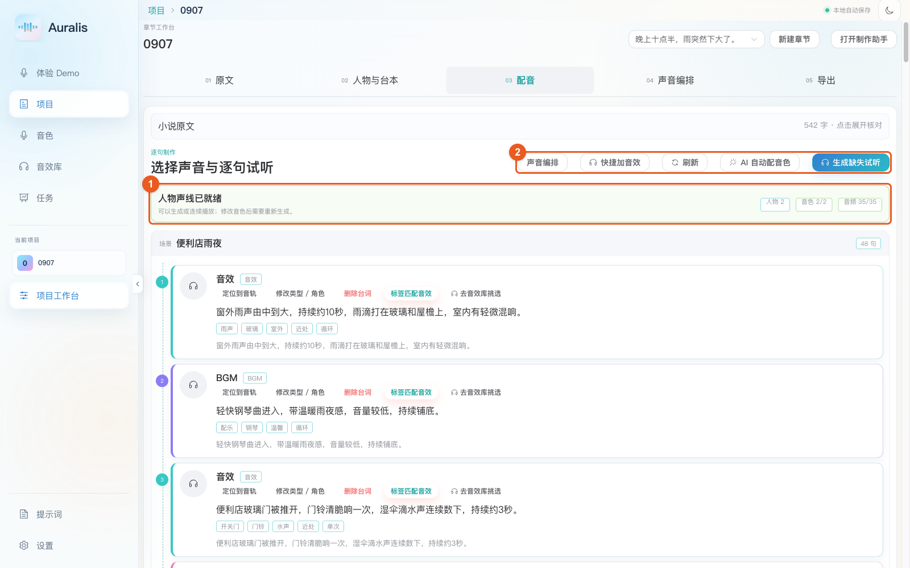

- **① 就绪状态：** 本例为 2 位人物、2/2 个独立音色、35/35 条人声配音。此处统计的是人声，不包含所有音效/BGM 行。
- **② 生成入口：** 首次使用“生成全部试听”；已有部分音频时显示“生成缺失试听”；更换声线后可能显示“按新音色重新生成”。生成任务可在侧栏“任务”查看。

每句左侧播放按钮用于试听该句。点击台词正文或“展开”打开编辑面板；下面以第 4 行“欢迎光临。”为例：

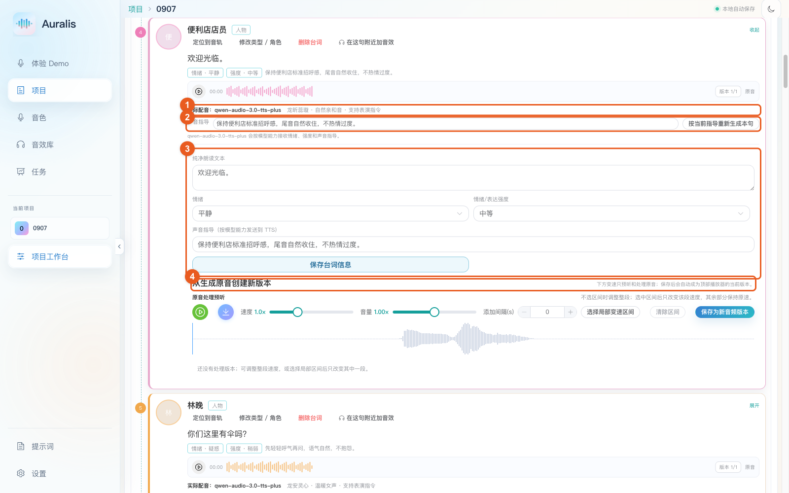

1. **① 先看实际配音。** 本句使用 `qwen-audio-3.0-tts-plus` 与“龙昕蕊璇 · 自然亲和音”，界面标明支持表演指令。
2. **② 只调整表演：** 修改单句“声音指导”，再点“按当前指导重新生成本句”。本句原有指导是“保持便利店标准招呼感，尾音自然收住，不热情过度。”
3. **③ 修改台词信息：** 编辑纯净朗读文本、情绪、表达强度和声音指导，点击“保存台词信息”。**保存文字或指导不会自动重配音**，随后还要生成该句并试听。
4. **④ 已有声音只需后期调整：** 在“从生成原音创建新版本”区域预听速度、音量或间隔；需要局部变速时选择区间，再点击“保存为新音频版本”。保存后的处理版本会成为当前采用版本，原音保留。

两类版本的用途不同：

| 版本 | 什么时候用 | 如何选用 |
| --- | --- | --- |
| 生成音频版本 | 修改台词、音色或表演指导后，让 TTS 重新演绎 | 多次生成后，用台词播放器旁的版本下拉框切换 |
| 处理版本 | 保留同一段表演，只做速度、音量等后期调整 | 在展开区试听，点击“设为当前”；新保存的处理版本自动采用 |

试听满意后再处理下一句。页面底部的“逐句人声连播”适合检查对白衔接；**带雨声、BGM 和重叠音效的最终效果，要到时间线渲染后试听。**

若模型是 Edge-TTS，声音指导只会近似映射为整句语速、音高和音量，不能等同于理解完整表演要求。以每句下方的能力提示为准。

<a id="tutorial-sound"></a>

### 5. 给场景补音效与 BGM

正式写入章节后，“人物与台本”显示对白、旁白和文字编辑；“配音”用于人声试听。音效与 BGM 集中放在“声音编排”的“音效与背景音乐”列表中，已有素材可直接试听，未绑定音频的条目显示“待选素材”。

声音说明是**声音需求**，不是已经存在的音频。比如“雨滴打在玻璃和屋檐上”还需要选素材并调整编排。

**给已有声音条目配素材：** 在声音编排的列表中点击“选择素材”或“标签匹配”，也可使用工具栏的“标签匹配音效”。下面是本例开场雨声的匹配结果：

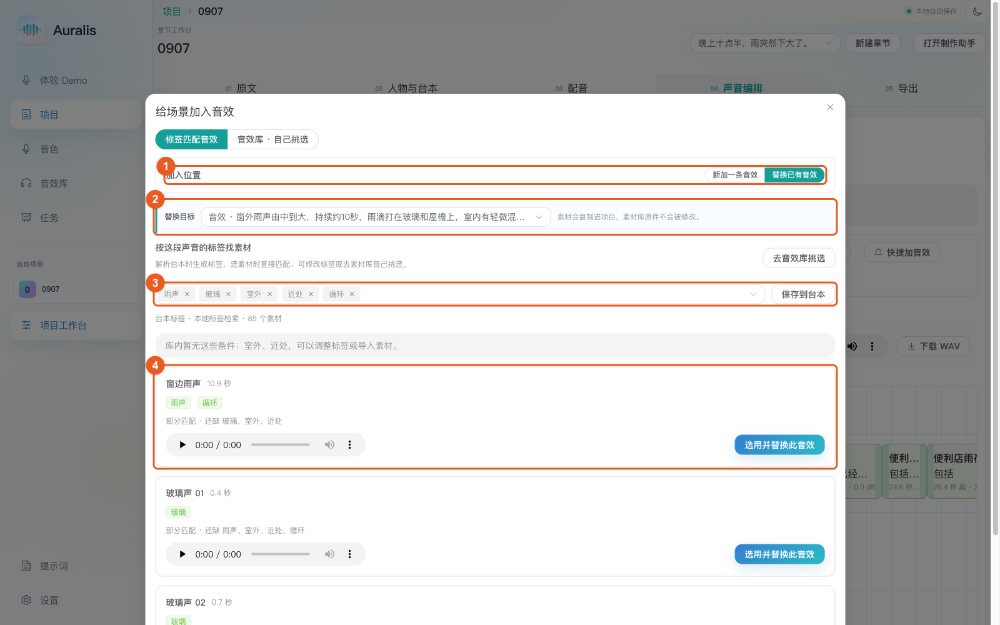

1. **① 选择“替换已有音效”。** 给台本中已有的声音行补素材时用这个模式。
2. **② 核对替换目标。** 确保指向开场雨声，而非结尾雨声或其他句子。
3. **③ 调整检索标签。** 声源、材质、场景都可以作为条件；需要下次复用时点“保存到台本”。标签检索在本地进行，不需要再次调用改编模型。
4. **④ 先试听，再选用。** 确认素材后点“选用并替换此音效”。“部分匹配”会列出缺失标签；例如“玻璃声”命中了材质，却不一定是想要的雨声，不能只看排名。

**新增声音或自己挑选：** 在声音编排页点击“快捷加音效”，切换“音效库 · 自己挑选”。台词页的加音效入口会先带你进入声音编排；在素材库选择定位台词。

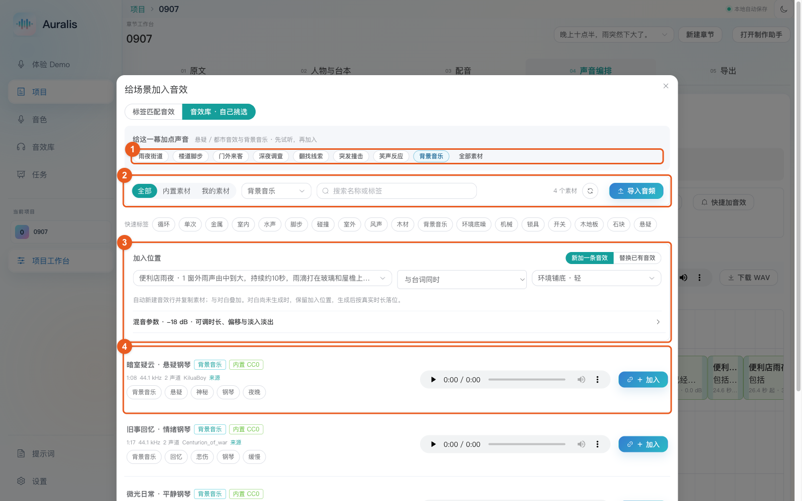

- **① 快速筛选：** 可选雨夜街道、门外来客、笑声反应、背景音乐等。本图展示背景音乐分类，不表示其中每首都已用于「0907」。
- **② 搜索与导入：** 按名称或标签筛选；找不到合适声音时，用“导入音频”加入自己的素材。截图时本地库有 85 个内置可见素材。
- **③ 加入位置：** “新加一条音效”会新增声音行。选定位台词、句前/同时/句后及混音方式，必要时展开“混音参数”调整音量、截取上限、偏移与淡入淡出。
- **④ 素材行：** 查看时长、来源、标签并试听，满意后点击“＋ 加入”。仅浏览或试听不会把素材写入章节。

**避免重复：** 已有“开门声”行缺音频，应使用“替换已有音效”；只有确实想多加一层声音时才选“新加一条音效”。加入或替换后，到声音编排页刷新时间线并重新渲染。

本例第 20、43 行的“林晚短促轻笑”仍被记录为音效。若希望使用林晚本人的声线，可在声音编排的对应声音条目中点击“修改类型 / 角色”，选择“人物台词（含角色笑声、叹气）”和林晚，实际发声文字填“呵。”等，表演要求放在声音指导中，再生成该句。**类型修改会使该句需要重新配音或选素材；本教程未替示例执行这些修改。**

<a id="tutorial-timeline"></a>

### 6. 声音编排：位置、循环、倍速和音量

点击顶部“声音编排”，必要时点击“构建/刷新时间线”。它根据当前选用音频的真实时长构建人物声、旁白、音效、BGM 四条轨道；刷新会保留已有手动调整。

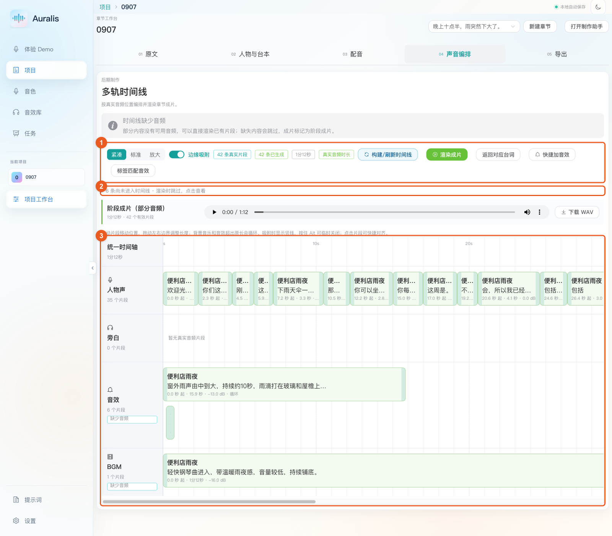

1. **① 工具栏：** “紧凑 / 标准 / 放大”调整显示密度；打开“边缘吸附”便于对齐；“渲染成片”用于听实际混音。
2. **② 缺失清单：** 展开可看到未进入时间线的台词，点击条目返回处理。已有 42 个片段不代表 48 行全部完成。
3. **③ 四轨编排：** 同一横向时刻的声音会同时播放。本例人物声从 0 秒开始，雨声与 BGM 在下方叠加；旁白轨为空，因为当前没有旁白片段。向右横向滚动可查看后续台词。

常用操作：

| 操作 | 方法 |
| --- | --- |
| 改变入场时刻 | 拖动片段整体；或点击片段填写开始时间 |
| 调整长度 | 拖动左右边界；音效/BGM 延长超过单次播放时长后循环，人物声/旁白受源音频长度限制 |
| 对齐声音 | 拖动时吸附到其他片段边缘；按住 Alt 临时关闭吸附 |
| 快捷对齐 | 点击片段，选择“对齐参考片段”，再用起点对齐、终点对齐、接在后面或覆盖参考片段 |
| 铺底与收尾 | 对音效/BGM 使用“铺满人声”、延长时长，配合较低音量与淡入淡出 |

雨声、钢琴等持续铺底声音可以跨越多句对白；在声音列表点击“编辑时长与位置”，使用“铺满人声”或填写片段长度，保存后生效。列表播放器试听素材原音，最终叠加、循环和淡入淡出效果需渲染成片试听。

点击本例第 3 行对应的开门声片段，可查看更精确的设置：

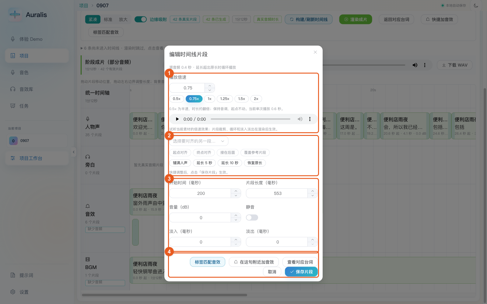

- **① 播放倍速：** 音效/BGM 支持 0.5×–2×。本例为 **0.75×**，单次播放从约 0.415 秒变为约 **0.553 秒**，起点仍是 **200 毫秒**。人物声的变速在配音页保存处理版本。
- **② 对齐与长度：** 选择参考片段后才可使用对齐按钮；“恢复原长”恢复当前倍速下的一次完整播放时长。
- **③ 混音参数：** 开始时间、长度、淡入淡出均以**毫秒**计，1000 毫秒 = 1 秒；音量单位为 dB，负值表示降低音量。本例开门声是 0 dB，BGM 在时间线上为 −16 dB，可依听感调整。
- **④ 保存片段：** 编辑框里的倍速、对齐与参数调整，点击“保存片段”才生效；查看后不想修改就点“取消”。

倍速试听用于比较当前素材的速度；裁剪、循环和淡入淡出要在重新渲染后听最终效果。循环是重复播放素材，不是把一次开门声自然延展成连续环境声，使用一次性拟音时需特别检查接缝。

<a id="tutorial-export"></a>

### 7. 渲染、检查并下载章节成片

切换到“导出”：

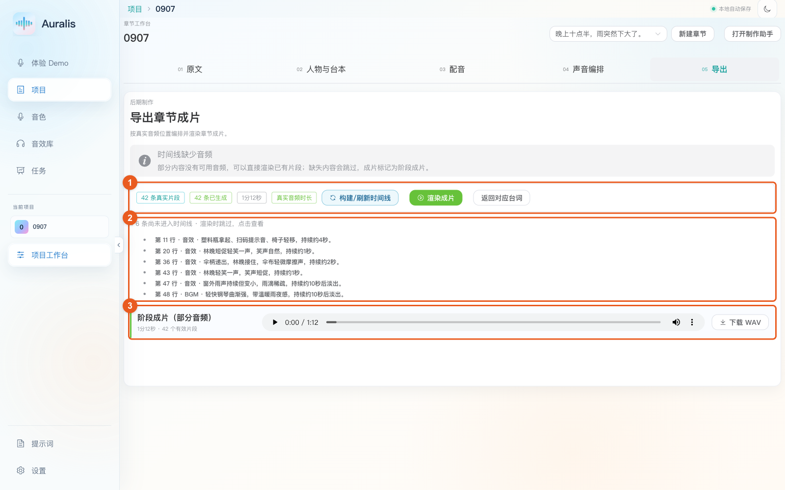

1. **① 更新成片。** 修改台词音频、选用版本或声音编排后，点击“构建/刷新时间线”，再点“渲染成片”；渲染操作也会先刷新时间线。等待出现成片播放器。
2. **② 检查缺失。** 本例还有第 11、20、36、43、47、48 行未配音频，因此会跳过这些内容并标注“阶段成片（部分音频）”。可先导出工作样片；要交付完整章节，应先补齐需要的声音，再渲染。
3. **③ 试听并下载。** 播放成片，检查对白是否清楚、雨声与 BGM 是否盖过人声、转场和结尾是否突兀，满意后点击“下载 WAV”。图中是「0907」已保存的约 1 分 12 秒阶段成片。

更换任何台词音频或调整片段后，旧成片可能过期。以最新一次渲染为准，不要把先前下载的 WAV 当作已同步更新的结果。

<a id="tutorial-faq"></a>

### 常见问题

| 现象 | 处理方法 |
| --- | --- |
| 运行验证成功，但网页打不开 | `./scripts/verify.sh` 检查后会退出；启动界面应运行 `./scripts/dev.sh` 并保持终端运行 |
| “人物与台本”之后的视图还是灰色 | 完成人物确认、台本审查与确认，等待正式台词写入；在助手区查看当前任务或错误 |
| 无法确认人物或批量配音按钮不可用 | 检查每位选中人物是否绑定独立且已启用的音色，以及每句的实际配音配置 |
| 改了文本、情绪或音色，听起来没有变 | 保存后重新生成对应台词；只换文字或绑定不会重写旧音频。若听的是成片，还要重新渲染 |
| 人声显示 35/35，但仍提示缺音频 | 人声完成数不包含音效/BGM；展开时间线的缺失清单逐行处理 |
| 标签匹配找不到想要的音效 | 检查声源标签、减少不必要条件，或到全库搜索/导入；部分标签命中不等于听感符合 |
| 音乐没有覆盖整段对白 | 点击 BGM 片段，用“铺满人声”或调整长度，保存后重新渲染 |
| 倍速变了，循环或淡出却没听到 | 素材播放器只预听倍速；完整混音以时间线渲染后的播放器为准 |
| 生成人声失败 | 在“任务”和制作助手查看错误，检查实际 TTS 配置、网络与账户可用状态，修正后重新生成失败句 |
| 台本中有多余句子 | 使用行内“删除台词”，核对确认框里的目标文本；删除会移除对应音轨，原音频与删除记录保留本地，目前没有界面一键撤销 |

截图取自本地浏览器，橙色框和编号是截图时临时叠加的教程标记，不属于应用界面。本文只发布操作说明和截图，不包含密钥、运行数据库或用户生成音频。

## 当前架构

Auralis 采用 Vue 3 + FastAPI + SQLAlchemy/SQLite 的本地优先架构。主改编流程由数据库状态机推进，制作助手是最多三轮“规划 → 工具执行 → 观察”的受控 Agent；项目事实、音频版本与流程检查点保存在数据库中。

正式制作统一在章节工作台完成：原文 → 人物与台本 → 配音 → 声音编排 → 导出，旧时间线与 Studio 链接会定位到对应项目。详见 [当前架构与本轮整合](docs/architecture-2026-09-05.md)。

## 项目结构

```text
.
├── SonicVale/app
│   ├── main.py                         # FastAPI 应用入口
│   ├── routers                         # 项目、台词、会话、Provider 与队列 API
│   ├── services                        # 工作流、助手、TTS、台本、人物与台词逻辑
│   ├── core                            # Provider 配置、LLM/TTS 引擎、WebSocket
│   └── models / entity / dto           # SQLAlchemy 模型与 API 数据结构
├── sonicvale-front
│   ├── src/pages                       # 桌面工作台页面
│   ├── src/components/workflow         # 助手、台本、人物与生产面板
│   └── electron                        # Electron 桌面壳
├── scripts
│   ├── dev.sh                          # 本地开发启动
│   ├── verify.sh                       # 后端与前端验证
│   └── seed_demo.py                    # 本地演示项目生成器
└── docs                                # 架构与交接文档
```

当前核心生产流程由显式 SQL 状态和服务层驱动，而不是 LangGraph。数据库表是流程状态的事实来源，每一次状态转换都可以在应用服务中检查，重试和审查逻辑也能在不引入额外图运行时的情况下测试。

## 技术栈

- 桌面与 Web：Electron、Vue 3、Element Plus、Vite
- 后端：FastAPI、SQLAlchemy、Pydantic、SQLite
- AI：兼容 OpenAI 协议的对话模型服务、结构化 JSON 校验与回退解析
- TTS：Edge-TTS、兼容 DashScope 的 TTS 路径和可配置 HTTP Provider
- 音频：基于 FFmpeg 的本地处理与导出
- 验证：Python 测试与 `scripts/verify.sh` 前端生产构建

## 设计要点

- 制作助手、原文解析、人物设计、台本写作和台本审查分别使用独立 Prompt。
- 对模型结构化输出进行 Schema 校验、回退归一化和异常格式测试。
- 初稿生成后执行独立审查，再交由用户确认最终台本。
- 长耗时 AI 步骤通过 WebSocket 推送进度，并使用 REST 进行状态恢复。
- 音频重新生成采用逐句版本管理，播放和导出读取用户选择的当前版本。
- 时间线以持久化片段坐标作为最终混音的事实来源，并生成可复现 Manifest 和过期检测信息。
- 本地保存 Provider 配置快照，用于恢复误操作造成的配置变化。

## 本地运行

环境要求：macOS 或 Linux、Python 3.12、Node.js 22、npm 和 FFmpeg。首次安装测试依赖使用 `SonicVale/.venv/bin/pip install -r SonicVale/requirements-test.txt`。

启动后端和前端：

```bash
./scripts/dev.sh
```

默认地址：

```text
前端:     http://127.0.0.1:5173
后端:     http://127.0.0.1:8200
API 文档: http://127.0.0.1:8200/docs
```

运行隔离的离线工程检查（不调用模型、不读取真实工程库）：

```bash
./scripts/verify.sh
```

构建 GitHub Pages 使用的静态 Demo：

```bash
cd sonicvale-front
npm run build:demo
```

无需外部 AI/TTS Provider 生成本地样例项目：

```bash
SonicVale/.venv/bin/python scripts/seed_demo.py --reset
```

## 配置

运行数据默认保存在本地。开发脚本使用 `.local-data` 保存项目状态、Provider 快照、日志和工作流产物。

常用工作流配置：

```text
WORKFLOW_CHAT_UI_ENABLED=true
WORKFLOW_TTS_REVIEW_ENABLED=true
DRAMA_WORKFLOW_MAX_ITERATIONS=8
DRAMA_WORKFLOW_MAX_SOURCE_CHARS=120000
DRAMA_WORKFLOW_MAX_DRAFT_CHARS=180000
CHAT_EVENT_REPLAY_LIMIT=100
```

Provider 密钥应通过应用界面或本地环境文件配置。密钥、运行数据库、生成音频、虚拟环境和前端构建产物不会提交到 Git。

## 许可证与来源

本仓库包含 Auralis 原型的大量产品、工作流和界面改造，同时保留了来自开源项目 [SonicVale](https://github.com/xcLee001/SonicVale) 的组件。

SonicVale 使用 AGPL-3.0 许可证。分发或部署修改版本时，请保留原始署名并遵守 AGPL-3.0。
