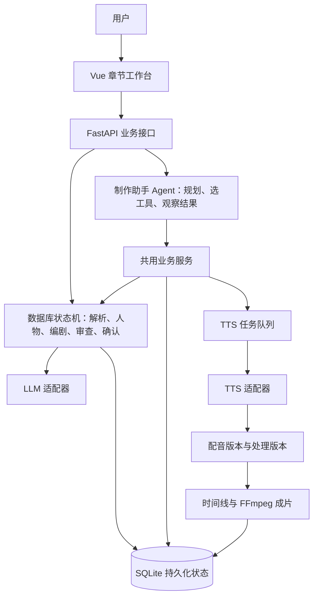

# Auralis 当前架构与章节工作台

核对日期：2026-09-05。本文描述当前实现，历史设计文档不能代替实际调用链。

Auralis 是一个本地优先、前后端分离的模块化单体应用。Vue 3 界面调用 FastAPI；SQLAlchemy 和本地 SQLite 保存项目、章节、草稿修订、任务和时间线状态；后台队列执行 TTS，FFmpeg 处理与混音。开发时运行浏览器页面，Electron 为桌面容器。

AI 部分采用“确定工作流 + 受控制作助手 Agent”的混合结构：

## 是否是 Agent

- 主改编流程由 `DramaWorkflowService` 的显式状态和动作表推进；编剧、审查服务是固定流程中的专用调用，不是各自独立自主决策的多 Agent。
- `ProductionAssistantAgent.run_turn` 由模型输出受校验的工具计划，执行后把结果作为 observations 再次提供给模型，最多三轮；支持查询、修改台词、换音色、创建配音任务和播放动作，因此这部分属于受控工具型 Agent。
- 模型决定工具，业务服务负责校验权限、阶段和数据。聊天记录并不代替数据库中的项目事实。
- 当前没有 OpenAI Agents SDK 的 `Agent/Runner/function_tool` 运行时，也没有把主制作流程交给 LangGraph；使用兼容 Chat Completions 的客户端，不影响助手具备 Agent 行为。
- 对外建议描述：“以数据库工作流保证制作可恢复，用受控 Agent 处理自然语言制作操作的 AI 广播剧工作台。”

概念参考：[Anthropic 对 workflows 与 agents 的区分](https://www.anthropic.com/engineering/building-effective-agents)。架构判断依据本仓库当前代码。

## 本轮落地

1. 正式项目以 `/projects/:id/workspace?chapter_id=...&view=...` 为统一入口，原文、人物与台本、配音、声音编排、导出是同一章节的视图；页面视图不改变后端流程阶段。
2. 原 `/timeline?project_id=...&chapter_id=...` 和 `/studio/session/...` 保留跳转兼容。原结构化 Studio 页面退出新制作入口；旧 `/drama-adaptation` API 标记为历史兼容，保留旧客户端与历史运行记录，不进行破坏性移除。新 UI 统一使用 `/chat/sessions` 工作流。
3. 既有章节可幂等打开工作台，无需重跑解析、重生成台本或声音。待确认会话继续保留原阶段。
4. `ProductionSteps`、`TimelineTracks`、`CuePlacementSelect` 在 Demo 和正式工作台复用；`ChapterTimeline` 同时承载声音编排和导出。正式台本编辑、角色卡与音效库沿用现有组件。
5. 台词和音轨通过 `line_id` 双向定位，制作助手可展开或收起。
6. 实际模型、音色、绑定来源、启用状态和指令能力由后端解析；能力规则与 TTS 请求适配器共用，接口不返回密钥。角色音色绑定优先于项目默认配置。
7. 台词、声音指导、情绪或音色变化后标记需重新配音，时间线标记过期；配音原件与版本记录不删除。播放器、处理服务与时间线共用采用音频的解析规则，避免听到和导出不同版本。
8. 后台 TTS 工作者从服务工厂获得依赖，不再导入 HTTP routers；页面和 Agent 换音色均通过 RoleService，避免绕过状态失效处理。
9. 在 LLM 请求入口明确拒绝 `qwen-plus` 及其变体，要求改用 `qwen3.8-27b` 或 `kimi-k3`。本次验收不调用任何云端生成模型。

## 验收与边界

- `./scripts/verify.sh`：隔离临时数据库运行后端测试、API smoke、时间线混音/导出检查、前端路由和 WebAudio 测试、生产构建。
- 新增用例覆盖：历史章节幂等打开、项目归属、保留待确认、配置覆盖与密钥排除、音色/指导变更失效、播放与时间线选择一致、禁用模型在网络调用前拦截。
- 浏览器以原项目 12、章节 8 验收：18 个真实片段、46.2 秒成片、跨视图定位、原文/导出、模型信息；原配音文件不重生成。
- 本轮是现有单体应用内的流程整合，没有增加 Agent 数量、模型调用次数或分布式服务。历史 API 的移除需要单独安排兼容迁移。
- 个人 `测评库/` 继续仅本地保存，不进入 Demo、提交和部署。
