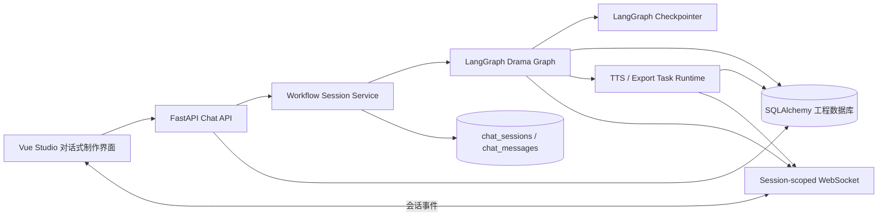
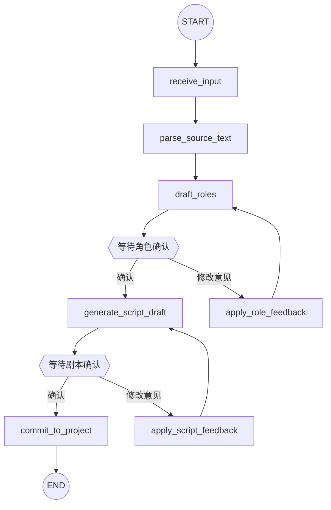

# Auralis LangGraph 对话式改编架构实现方案

> **归档说明（2026-07-13）**：本方案对应早期架构，当前运行时已移除 LangGraph。现行实现使用 SQLAlchemy 数据库状态机，`chat_sessions / adaptation_runs / adaptation_draft_revisions` 是唯一状态源；常驻自由对话由 `ProductionAssistantAgent` 和受控业务工具负责。本文不再作为实施依据。

> 文档状态：实施设计稿
>
> 适用项目：Auralis / SonicVale
>
> 目标：将现有同步式 AI 改编流程升级为可恢复、可确认、可迭代的对话式制作流程，同时保留现有项目、章节、角色、台词、配音和导出能力。

## 1. 结论与实施原则

### 1.1 结论

Kimi 提出的方向总体可行，但不建议原样进行“全量 LangGraph 重构”。当前项目已经有一套可工作的工程数据模型和音频生产链路，最合适的方案是增加一个 LangGraph 工作流层，把它用于以下职责：

- 管理 AI 改编过程中的阶段状态。
- 管理用户确认、反馈和继续执行。
- 保存可恢复的会话检查点。
- 将长流程拆成可观测的节点。
- 在角色设计和剧本生成之间提供人工确认点。

现有的 SQLAlchemy 数据库仍然负责保存正式项目数据，LangGraph 不取代项目数据库。

### 1.2 两套状态的边界

| 状态类型 | 事实来源 | 保存内容 | 作用 |
| --- | --- | --- | --- |
| 工程项目状态 | SQLAlchemy 数据库 | 项目、章节、角色、声音、台词、素材、任务、导出记录 | 用户最终认可并用于生产的正式数据 |
| 工作流会话状态 | LangGraph checkpointer + `chat_sessions` | 当前阶段、草稿、用户反馈、待确认动作、错误、执行历史 | AI 改编过程中的临时状态和可恢复上下文 |

核心规则：

1. 草稿可以写入会话状态，但不能直接覆盖正式项目数据。
2. 只有用户确认或明确提交后，才允许写入 `roles`、`chapters`、`lines` 等正式表。
3. LangGraph checkpoint 用于恢复流程，不作为长期项目数据查询接口。
4. 长文本、音频和素材文件不直接塞入 checkpoint，只保存数据库 ID、文件路径或对象存储键。
5. 每个会话使用独立的 `thread_id`，不能使用全局共享线程。

### 1.3 第一版边界

第一版只覆盖一章的对话式改编：

```text
小说文本
  -> 解析内容
  -> 生成角色草稿
  -> 用户确认角色
  -> 生成广播剧台词草稿
  -> 用户确认剧本
  -> 提交到现有项目数据表
```

以下能力暂不放入第一版 LangGraph 主流程：

- 全书一次性改编。
- 节点任意跳转。
- 把 TTS 播放轮询写成图节点。
- 把音频文件二进制放入图状态。
- 多用户协作权限。
- 自动修改已经发布的正式版本。

TTS 和音频审核在第二阶段接入，通过独立任务系统与会话事件关联。

## 2. 当前代码与目标架构

### 2.1 当前实现概况

当前后端主要位于 `SonicVale/app`，技术栈为 FastAPI、SQLAlchemy、SQLite、OpenAI 兼容 LLM 接口、Edge-TTS/DashScope/自定义 TTS、WebSocket 和 FFmpeg。当前改编主链路由以下模块承担：

- `SonicVale/app/services/drama_adaptation_service.py`
  - 解析小说文本。
  - 生成广播剧台词。
  - 润色台词。
  - 可选提交到项目、章节、角色和台词表。
- `SonicVale/app/routers/drama_adaptation_router.py`
  - 创建改编任务。
  - 查询运行状态。
  - 提交改编结果。
- `SonicVale/app/core/ws_manager.py`
  - 当前是简单的全局广播管理器。
- `SonicVale/app/core/tts_runtime.py`
  - 负责 TTS 队列和后台生成。
- `SonicVale/app/models/po.py`
  - 已有项目、章节、角色、声音、台词、改编运行记录等表。

当前主要问题：

- 改编服务以同步顺序调用为主，单次请求容易持续较长时间。
- AI 输出阶段没有统一的会话概念，用户反馈无法自然地回到原流程。
- 页面刷新或进程中断后，无法可靠恢复到上次待确认节点。
- WebSocket 事件缺少项目和会话隔离，后续无法安全支持多个工作流并发。
- 改编草稿与正式项目数据的边界不够清晰。
- TTS 长任务与改编流程之间没有统一的任务关联和错误恢复模型。

### 2.2 目标架构



模块职责：

- Vue 页面负责展示会话、草稿、确认卡片和错误恢复入口。
- Chat API 负责会话生命周期和用户动作，不直接承载复杂 LLM 编排。
- Session Service 负责鉴权、状态读取、幂等、事件发布和事务边界。
- LangGraph 负责节点编排、条件路由、暂停和恢复。
- SQLAlchemy 数据库保存正式项目数据和可查询的会话摘要。
- TTS/导出运行时继续使用现有后台任务机制，不被 LangGraph 阻塞。

## 3. 依赖与基础设施调整

### 3.1 Python 依赖

在 `SonicVale/requirements.txt` 增加并锁定经过验证的兼容版本：

- `langgraph`
- `langchain-core`
- `langgraph-checkpoint-sqlite`
- `aiosqlite`

版本要求应以项目实际 Python 版本和 FastAPI/SQLAlchemy 版本测试结果为准，不建议直接使用浮动的最新版本。SQLite checkpoint 包要求 Python 3.10 或更高版本，应在启动时明确检查 Python 版本。

LangGraph 官方持久化模型是以 `thread_id` 标识一条可恢复线程，并将图状态保存为 checkpoints；长期业务数据则应使用独立的 Store 或业务数据库。参考：[LangGraph Persistence](https://docs.langchain.com/oss/python/langgraph/persistence) 和 [Checkpoints Reference](https://reference.langchain.com/python/langgraph/checkpoints)。

### 3.2 Checkpointer 选择

开发和单机部署优先使用 SQLite：

- 同步执行场景使用 `SqliteSaver`。
- 异步 FastAPI 场景使用 SQLite 异步 saver，并验证连接生命周期。
- checkpoint 数据放在应用数据目录，不放入前端目录。
- 初始化时创建专用 checkpoint 数据库或专用连接，不与业务 ORM session 复用同一个连接对象。

生产环境如果改为 PostgreSQL，应将 checkpointer 替换为 PostgreSQL 实现，业务数据和工作流 checkpoint 仍保持逻辑隔离。SQLite checkpoint 包的安装和 Python 要求见其 [PyPI 文档](https://pypi.org/project/langgraph-checkpoint-sqlite/)。

### 3.3 配置项

新增配置项建议放入现有配置系统：

```text
LANGGRAPH_ENABLED=true
LANGGRAPH_CHECKPOINT_DB=./data/auralis-checkpoints.sqlite3
DRAMA_GRAPH_MAX_ITERATIONS=8
DRAMA_GRAPH_MAX_SOURCE_CHARS=120000
DRAMA_GRAPH_MAX_DRAFT_CHARS=180000
CHAT_SESSION_EXPIRE_DAYS=30
CHAT_EVENT_REPLAY_LIMIT=100
```

配置原则：

- `LANGGRAPH_ENABLED=false` 时保留旧改编接口，便于回滚。
- 所有 LLM 和 TTS 密钥继续由现有 provider 配置管理。
- 不把密钥、完整原文和音频二进制写入消息表或 checkpoint。

## 4. 后端目录设计

新增工作流模块：

```text
SonicVale/app/workflows/
  __init__.py
  drama/
    __init__.py
    state.py          # Graph State 类型定义
    schemas.py        # 节点输入输出和用户动作模型
    nodes.py          # 各业务节点
    graph.py          # StateGraph 构建、条件边、interrupt
    checkpoint.py     # checkpointer 初始化和生命周期
    events.py         # 工作流事件类型和发布适配器
```

新增会话服务：

```text
SonicVale/app/services/
  chat_session_service.py
  drama_workflow_service.py
```

建议拆分现有 `drama_adaptation_service.py`：

- `source_parser_service.py`
  - 文本清洗、章节边界、内容摘要。
- `role_draft_service.py`
  - 从解析结果生成角色草稿。
- `script_draft_service.py`
  - 生成广播剧台词草稿。
- `drama_commit_service.py`
  - 将已确认草稿写入正式项目表。
- `drama_adaptation_service.py`
  - 保留旧接口的兼容外观，内部可以调用拆分后的服务。

这样既能让 LangGraph 节点保持短小，也能让旧 API 和非对话式批处理继续使用相同的业务能力。

## 5. Graph State 设计

### 5.1 状态字段

建议定义一个明确的 `DramaWorkflowState`，字段分为标识、输入、草稿、确认、控制和错误几组：

```text
session_id: str
project_id: int
chapter_id: int | None
source_document_id: int | None
source_text_ref: str | None
source_text: str | None
user_instruction: str | None

current_stage: str
conversation_summary: str | None
role_drafts: list[dict]
confirmed_roles: list[dict]
script_draft: dict | None
confirmed_script: dict | None

pending_confirm: dict | None
user_action: dict | None
user_feedback: str | None
iteration_count: int

last_event_id: str | None
error_code: str | None
error_message: str | None
```

对于大型原文和大型草稿，推荐使用引用字段：

- 原文存入现有项目文件或新增 source document 表。
- 草稿的完整版本存入 `adaptation_runs` 或单独的 draft revision 表。
- Graph State 只保留当前节点所需的摘要、ID 和小型结构化数据。

### 5.2 阶段枚举

阶段值固定，不允许前端自由传入任意字符串：

```text
created
parsing
role_draft_ready
awaiting_role_confirmation
generating_script
script_draft_ready
awaiting_script_confirmation
committing
completed
failed
cancelled
```

### 5.3 用户动作

```json
{
  "action": "confirm_roles",
  "feedback": "保留林默和苏晚，旁白语气更克制",
  "payload": {
    "roles": [
      {"name": "林默", "voice_type": "young_male"},
      {"name": "苏晚", "voice_type": "young_female"}
    ]
  }
}
```

允许的动作：

- `confirm_roles`
- `revise_roles`
- `confirm_script`
- `revise_script`
- `retry`
- `cancel`
- `commit`

所有动作必须校验当前阶段。例如在 `awaiting_role_confirmation` 阶段不能提交 `confirm_script`。

## 6. Graph 节点和路由

### 6.1 第一版节点



### 6.2 节点职责

#### `receive_input`

- 校验项目、章节和原文引用是否存在。
- 创建 `chat_sessions` 记录。
- 创建首条用户消息。
- 初始化 `current_stage=created` 和 `iteration_count=0`。

#### `parse_source_text`

- 从 source reference 读取文本。
- 清洗不可见字符和异常格式。
- 识别人物、场景、时间、事件和对白线索。
- 输出结构化解析结果，存入 `adaptation_runs.parsed_json`。
- 失败时返回可理解的错误代码，不让异常直接暴露给前端。

#### `draft_roles`

- 根据解析结果生成角色草稿。
- 为每个角色输出姓名、身份、性格、关系、表达特点和建议声线。
- 检查角色名重复、空角色、无效声线类型。
- 更新 `current_stage=awaiting_role_confirmation`。
- 发布 `role_draft_ready` 事件。

#### `apply_role_feedback`

- 读取用户反馈和选中的角色修改。
- 只更新角色草稿，不写正式 `roles` 表。
- 增加 `iteration_count`。
- 超过最大迭代次数时要求用户重新确认或手动编辑。

#### `generate_script_draft`

- 使用已确认角色和解析结果生成广播剧台词。
- 输出统一的 line schema：角色、台词内容、类型、情绪、强度、顺序和场景。
- 通过 Pydantic 校验，不接受无法解析的自由文本作为正式草稿。
- 存入 `adaptation_runs.draft_json` 或 `final_json` 的草稿版本。
- 更新 `current_stage=awaiting_script_confirmation`。

#### `apply_script_feedback`

- 接受用户对指定台词、角色、场景或整体风格的反馈。
- 优先支持局部重写，不默认重写整章。
- 保留每次草稿版本，便于撤销和比较。
- 重新发布 `script_draft_ready` 事件。

#### `commit_to_project`

- 只允许在脚本已确认后执行。
- 在一个数据库事务中创建或更新章节、角色、台词和关联配置。
- 通过幂等键避免重复提交产生重复角色和台词。
- 写入 `adaptation_runs.committed_at` 和会话完成状态。
- 发布 `project_committed` 事件。

### 6.3 暂停和恢复策略

角色和剧本确认是明确的人工介入点。图在这些点暂停，API 收到用户动作后用同一个 `thread_id` 恢复。

恢复时必须同时满足：

- 会话存在且属于当前项目。
- 会话状态为 `awaiting_*`、`failed` 或可恢复状态。
- `thread_id` 与 `chat_sessions.id` 一致。
- 用户动作与当前 `pending_confirm.type` 匹配。
- 请求带有幂等键，重复请求不会重复生成或提交。

第一版不开放“从任意历史节点回退”。需要回退时，创建新的 revision，复制必要输入并从固定阶段重新执行。

## 7. 数据库设计

### 7.1 `chat_sessions`

建议新增表：

| 字段 | 类型 | 说明 |
| --- | --- | --- |
| `id` | string/UUID | 会话 ID，同时作为 LangGraph `thread_id` |
| `project_id` | integer | 所属项目 |
| `chapter_id` | integer nullable | 目标章节 |
| `status` | string | `active/completed/failed/cancelled/expired` |
| `current_stage` | string | 当前工作流阶段 |
| `active_confirm_type` | string nullable | 当前待确认类型 |
| `title` | string nullable | 会话标题 |
| `last_error_code` | string nullable | 稳定错误码 |
| `last_error_message` | text nullable | 面向用户的错误信息 |
| `created_at` | datetime | 创建时间 |
| `updated_at` | datetime | 更新时间 |
| `completed_at` | datetime nullable | 完成时间 |

索引：

- `(project_id, updated_at)`
- `(project_id, status)`
- `(chapter_id, status)`

### 7.2 `chat_messages`

建议新增表：

| 字段 | 类型 | 说明 |
| --- | --- | --- |
| `id` | UUID | 消息 ID |
| `session_id` | string/UUID | 所属会话 |
| `role` | string | `user/assistant/system/tool` |
| `message_type` | string | `text/role_draft/script_draft/confirm/error/status` |
| `content` | text nullable | 可展示文本 |
| `payload_json` | JSON nullable | 结构化内容 |
| `client_request_id` | string nullable | 幂等请求 ID |
| `created_at` | datetime | 创建时间 |

索引和约束：

- `(session_id, created_at)`。
- `client_request_id` 在同一会话内唯一。
- `payload_json` 只存结构化草稿和展示所需数据，不存敏感密钥。

### 7.3 `adaptation_runs` 扩展

现有 `AdaptationRunPO` 建议增加：

```text
session_id: string nullable
is_conversational: boolean default false
source_revision: integer default 1
draft_revision: integer default 1
committed_at: datetime nullable
```

已有的 `parsed_json`、`draft_json`、`final_json` 可以继续使用，但要明确含义：

- `parsed_json`：本次改编的解析结果。
- `draft_json`：当前或最近一次未提交草稿。
- `final_json`：用户确认后准备提交或已经提交的最终结构。

### 7.4 迁移要求

当前项目存在手写 SQLite 初始化和迁移逻辑，新增表必须遵循现有数据库启动方式，同时补充：

- 幂等创建。
- 老版本数据库升级。
- 失败时事务回滚。
- 迁移后字段检查。
- 新旧 API 兼容窗口。

不能只在开发环境删除 SQLite 文件重建，因为这会破坏现有项目和用户数据。

## 8. API 设计

建议新增 `SonicVale/app/routers/chat_router.py`，统一使用 `/chat/sessions` 前缀。

### 8.1 创建会话

`POST /chat/sessions`

请求：

```json
{
  "project_id": 1,
  "chapter_id": null,
  "source_text": "小说原文或已上传文本引用",
  "source_document_id": null,
  "instruction": "改编成节奏紧凑的悬疑广播剧，保留关键心理描写"
}
```

约束：`source_text` 和 `source_document_id` 二选一。长文本应先上传并只传 `source_document_id`。

响应：

```json
{
  "session_id": "sess_01J...",
  "thread_id": "sess_01J...",
  "project_id": 1,
  "status": "active",
  "current_stage": "created"
}
```

### 8.2 获取会话

`GET /chat/sessions/{session_id}`

返回会话摘要、当前阶段、待确认动作、最近错误和关联项目 ID。默认不返回完整 checkpoint。

### 8.3 获取消息

`GET /chat/sessions/{session_id}/history?limit=100&before_id=...`

按时间顺序返回消息。需要支持分页，防止长会话一次性加载过多内容。

### 8.4 发送用户消息

`POST /chat/sessions/{session_id}/message`

```json
{
  "message": "把林默改成更冷静的表达方式",
  "client_request_id": "web-uuid-001"
}
```

该接口适合自由文本反馈。服务端根据当前阶段把消息转换为 `revise_roles` 或 `revise_script`。

### 8.5 提交确认动作

`POST /chat/sessions/{session_id}/confirm`

```json
{
  "confirm_type": "roles",
  "action": "confirm_roles",
  "feedback": "",
  "payload": {
    "roles": [
      {"draft_id": "r1", "name": "林默", "selected": true},
      {"draft_id": "r2", "name": "苏晚", "selected": true}
    ]
  },
  "client_request_id": "web-uuid-002"
}
```

### 8.6 恢复会话

`POST /chat/sessions/{session_id}/resume`

用于页面刷新、应用重启或任务失败后的恢复。服务端从 checkpointer 读取最新状态，并根据会话阶段继续执行。

### 8.7 提交到项目

`POST /chat/sessions/{session_id}/commit`

只有 `script_draft_ready` 且剧本已确认时允许调用。该接口必须幂等，并返回创建或更新的章节、角色、台词数量。

### 8.8 取消和删除

- `POST /chat/sessions/{session_id}/cancel`
- `DELETE /chat/sessions/{session_id}`

删除只删除会话展示数据，不应默认删除已经提交的项目数据或音频文件。已完成会话建议软删除。

## 9. WebSocket 事件设计

### 9.1 连接地址

建议：

```text
WS /ws/projects/{project_id}/sessions/{session_id}
```

如果保留现有全局 WebSocket 地址，应在服务端增加兼容层，但新页面必须使用会话级地址。

### 9.2 事件格式

```json
{
  "event_id": "evt_001",
  "event_type": "script_draft_ready",
  "session_id": "sess_01J...",
  "project_id": 1,
  "sequence": 18,
  "stage": "awaiting_script_confirmation",
  "payload": {
    "message_id": "msg_001",
    "draft_revision": 2,
    "line_count": 28
  },
  "created_at": "2026-07-10T12:00:00Z"
}
```

### 9.3 事件类型

第一版至少支持：

```text
session_created
stage_started
stage_progress
role_draft_ready
script_draft_ready
awaiting_confirmation
project_committed
workflow_completed
workflow_failed
workflow_cancelled
```

客户端必须处理以下情况：

- WebSocket 断开后自动重连。
- 通过 `last_event_id` 或 `sequence` 请求补发事件。
- 收到重复事件时幂等更新 UI。
- 页面首次打开先读 REST 快照，再接收实时事件。

### 9.4 `ws_manager` 改造要求

现有 `SonicVale/app/core/ws_manager.py` 不能继续只做全局广播。应改为：

- `project_id -> session_id -> connections` 的分层管理。
- 支持向单一会话广播。
- 支持向项目级页面广播摘要事件。
- 断开时清理连接。
- 禁止把一个项目的会话事件推送到另一个项目。
- 事件发布失败不能导致数据库提交失败，但必须记录日志。

## 10. 前端产品流程

### 10.1 工作台入口

在 `sonicvale-front/src/pages/Studio.vue` 增加两种制作模式：

- `对话式改编`：适合新用户和从小说开始制作。
- `结构化编辑`：适合已有章节、角色和台词的高级用户。

默认进入对话式改编，但从项目总览进入具体章节时可以直接打开结构化编辑。

### 10.2 新增组件

建议新增：

```text
sonicvale-front/src/components/workflow/
  ChatProductionPanel.vue
  ChatMessageList.vue
  ChatComposer.vue
  SessionStageStepper.vue
  SessionRestoreBanner.vue
  RoleDraftConfirmCard.vue
  ScriptDraftConfirmCard.vue
  WorkflowErrorCard.vue
  DraftRevisionBar.vue
```

组件职责：

- `ChatProductionPanel.vue`：会话容器、阶段状态和操作区。
- `ChatMessageList.vue`：展示用户消息、AI 状态、草稿和错误。
- `ChatComposer.vue`：文本输入、发送、取消和重试。
- `SessionStageStepper.vue`：展示解析、角色、剧本、提交阶段。
- `SessionRestoreBanner.vue`：提示存在未完成会话并提供继续入口。
- `RoleDraftConfirmCard.vue`：角色列表、声线建议、确认和修改。
- `ScriptDraftConfirmCard.vue`：按场景展示台词、局部修改、确认。
- `WorkflowErrorCard.vue`：错误原因、重试、返回编辑、重新开始。
- `DraftRevisionBar.vue`：草稿版本、更新时间和恢复上一版。

### 10.3 需要修改的 Vue 页面和组件

| 文件 | 改造内容 |
| --- | --- |
| `src/pages/Studio.vue` | 增加会话式改编入口、会话恢复、对话面板和结构化编辑切换 |
| `src/pages/ProjectOverview.vue` | 展示未完成会话、当前阶段、继续制作按钮和最近改编记录 |
| `src/pages/QueueBoard.vue` | 增加“改编会话”任务视图，区分等待确认、执行中、失败、完成 |
| `src/pages/ProjectDubbingDetail.vue` | 承接已提交剧本，展示 TTS 任务和音频审核，不承担改编会话逻辑 |
| `src/pages/ProjectList.vue` | 显示项目当前制作阶段和未完成会话标记 |
| `src/pages/Home.vue` | 将“新建项目”引导到向导或直接创建改编会话 |
| `src/pages/ConfigCenter.vue` | 提供模型、TTS、存储和工作流能力检测 |
| `src/components/project/NextActionPanel.vue` | 增加“继续改编会话”主操作 |
| `src/components/project/ReadinessChecklist.vue` | 增加 LLM、TTS、存储、项目数据和会话状态检查 |
| `src/components/project/ProjectProgressStepper.vue` | 与工作流阶段枚举对齐 |
| `src/api/drama.js` | 保留旧改编 API，同时新增 chat session API |
| `src/api/queue.js` | 增加会话任务和事件快照接口 |
| `src/router/index.js` | 支持带 `session_id` 的 Studio 路由和会话恢复路由 |
| `src/App.vue` | 统一 WebSocket 生命周期和全局错误提示边界 |

### 10.4 交互原则

- 用户永远能看到“现在进行到哪一步”。
- 需要用户确认时，主按钮必须明确写出动作，例如“确认角色并生成剧本”。
- AI 生成期间可以离开页面，返回后从项目总览继续。
- 任何失败都提供“重试当前步骤”和“查看详细原因”，不能只显示通用错误。
- 用户修改角色时只重新生成受影响部分，避免每次反馈都重做整章。
- 用户确认前展示草稿标识，确认后才显示“已加入项目”。

## 11. 与现有业务模块的集成

### 11.1 LLM

LangGraph 节点不直接读取前端配置，也不直接拼接 provider 字段。统一调用现有 `LLMEngine` 或抽出的 LLM service：

- 根据项目或全局配置选择 provider。
- 统一超时、重试、模型名称和 token 使用记录。
- 对返回结果做结构化解析和 schema 校验。
- 将 provider 错误映射为稳定错误码。

推荐错误码：

```text
LLM_PROVIDER_NOT_CONFIGURED
LLM_AUTH_FAILED
LLM_RATE_LIMITED
LLM_TIMEOUT
LLM_INVALID_RESPONSE
LLM_CONTENT_BLOCKED
```

### 11.2 角色与声音

角色草稿中的声线只是建议，不直接创建正式 `VoicePO`。用户确认角色后：

1. 创建或匹配 `RolePO`。
2. 根据确认的 voice preference 匹配已有声音。
3. 如果没有匹配声音，标记为待配置，而不是自动选择不可用 provider。
4. 在项目总览的 readiness 中提示未完成声线配置。

### 11.3 章节与台词

`commit_to_project` 复用现有 chapter/line service，避免工作流节点直接散落 SQL。提交时必须定义：

- 新建章节还是覆盖草稿章节。
- 角色同名如何合并。
- 台词顺序如何稳定生成。
- 情绪和强度找不到时使用什么默认值。
- 重复提交如何识别。

建议默认策略：新建一个 draft revision；用户明确选择“替换当前草稿”后再覆盖。

### 11.4 TTS 和导出

第一阶段只把已提交的台词交给现有 `tts_runtime.py`。TTS 任务应携带：

```text
project_id
chapter_id
session_id nullable
line_id
voice_id
task_id
```

第二阶段再增加音频审核节点，但审核状态仍应由音频任务和数据库记录负责，LangGraph 只等待结果和承载用户决策。

## 12. 事务、幂等和一致性

### 12.1 状态写入顺序

一个节点完成时推荐按以下顺序：

1. 执行业务计算。
2. 校验结构化输出。
3. 写入 `chat_messages` 和 `chat_sessions` 摘要。
4. 保存或更新 `adaptation_runs` 草稿。
5. 保存 LangGraph checkpoint。
6. 发布 WebSocket 事件。

正式项目提交则必须将项目表写入放在一个数据库事务内。checkpoint 和业务事务无法天然组成分布式事务，因此要定义补偿策略：

- 项目事务成功、事件发布失败：允许重放事件。
- checkpoint 成功、项目事务失败：会话进入 `failed`，允许重试提交。
- 业务事务部分失败：全部回滚，不写 `completed`。
- 重复提交：使用 `session_id + confirmed_script_revision` 作为幂等依据。

### 12.2 并发控制

同一会话只能有一个执行者：

- `chat_sessions` 增加执行锁或租约字段。
- 请求进入时检查 `running_token` 和过期时间。
- 用户重复点击确认时返回已有执行状态。
- 同一项目不同章节可以并行，但单章节提交应避免相互覆盖。

### 12.3 版本控制

至少保留：

- 角色草稿版本。
- 剧本草稿版本。
- 用户反馈消息。
- 最终提交对应的 revision。

不要通过覆盖 JSON 来实现“修改”，否则无法解释用户为什么看到当前结果，也无法安全恢复。

## 13. 错误处理和可观测性

### 13.1 用户可理解的错误

前端显示三层信息：

- 简短原因：例如“模型服务暂时不可用”。
- 当前动作：例如“角色草稿尚未生成”。
- 可执行操作：重试、修改配置、返回上一步、重新开始。

服务端日志保留：

- `session_id`
- `project_id`
- `thread_id`
- `stage`
- `node`
- `adaptation_run_id`
- provider/model
- 请求耗时
- 重试次数
- 错误类型

日志中不得写入完整原文、API key 或未经脱敏的用户内容。

### 13.2 指标

第一版建议记录：

- 会话创建到完成的耗时。
- 每个节点耗时和失败率。
- 角色确认通过率。
- 剧本确认平均迭代次数。
- 提交成功率。
- 会话恢复成功率。
- WebSocket 重连次数。
- LLM token 和费用估算。

## 14. 分阶段实施计划

### 阶段 0：基线和开关

工作量：中。收益：高。

目标：确保改造期间旧链路可回退。

工作项：

- 固化当前旧改编接口行为。
- 增加 `LANGGRAPH_ENABLED` 开关。
- 为 `drama_adaptation_service.py` 增加单元测试和结构化输出测试。
- 明确数据库备份和恢复流程。
- 记录当前 WebSocket、TTS 和提交流程的基线。

完成标准：关闭开关时现有 Demo 流程不受影响。

### 阶段 1：会话基础设施

工作量：大。收益：高。

修改范围：

- `requirements.txt`
- `app/models/po.py`
- 数据库初始化/迁移模块
- `app/core/ws_manager.py`
- 新增 `app/workflows/drama/*`
- 新增 `chat_session_service.py`
- 新增 `chat_router.py`

工作项：

- 创建 `chat_sessions` 和 `chat_messages`。
- 初始化 LangGraph checkpointer。
- 实现 session API 的创建、查询、历史、取消。
- 将 WebSocket 改为项目/会话隔离。
- 对旧 WebSocket 地址提供兼容期。

完成标准：可以创建一个空会话、刷新页面、查询历史并恢复会话；不会影响旧 TTS 队列。

### 阶段 2：单章对话式改编

工作量：大。收益：高。

工作项：

- 拆分解析、角色草稿、剧本草稿和提交服务。
- 实现 `receive_input -> parse -> roles -> role confirm -> script -> script confirm`。
- 增加 Pydantic schema 校验。
- 增加角色确认卡片和剧本确认卡片。
- 增加重试、取消、刷新恢复。

完成标准：新用户可以从一段小说文本完成一章剧本草稿，并通过确认后写入现有项目数据表。

### 阶段 3：正式项目提交和版本管理

工作量：大。收益：高。

工作项：

- 将提交逻辑改为事务和幂等。
- 增加草稿 revision。
- 支持同名角色合并策略。
- 项目总览展示会话、章节和提交关系。
- 旧 API 和新 Chat API 结果对齐。

完成标准：重复点击、网络重试、进程重启都不会产生重复章节或重复台词。

### 阶段 4：TTS 和音频审核接入

工作量：大。收益：高。

工作项：

- 将 TTS task 与 `session_id/chapter_id/line_id` 关联。
- 在会话中展示生成进度和音频结果。
- 支持单句重配、批量重配、替换声音。
- 支持用户确认后进入导出。
- 对接 `ProjectDubbingDetail.vue`、`QueueBoard.vue` 和音频播放器。

完成标准：用户可以从确认剧本继续完成配音审核，并能知道哪些台词已完成、失败或待重试。

### 阶段 5：多章节和高级能力

工作量：大。收益：中到高。

工作项：

- 全书按章节拆分和队列调度。
- 章节间角色和声音一致性检查。
- 全局术语表和人名读音表。
- 模板化广播剧风格。
- 用户自定义节点和工作流配置。
- PostgreSQL/对象存储部署模式。

完成标准：长篇项目可分批执行，失败章节可以独立重跑，不影响已完成章节。

## 15. 测试方案

### 15.1 单元测试

- 文本解析输出 schema。
- 角色草稿 schema 和重复角色校验。
- 台词 schema、情绪和强度映射。
- 节点条件路由。
- 用户动作与当前阶段匹配校验。
- session 幂等键。
- commit 的角色合并和台词顺序。
- 错误码映射。

### 15.2 工作流测试

使用假的 LLM provider 验证：

- 正常完成全流程。
- 角色确认后修改并重新生成。
- 剧本确认后修改局部台词。
- 节点中断后使用同一 thread 恢复。
- LLM 超时后重试。
- checkpoint 恢复后不重复写消息。
- commit 失败后重新提交。

### 15.3 API 测试

- 未知 session 返回 404。
- 跨项目访问返回 403 或 404，不泄漏数据。
- 非法阶段动作返回 409。
- 重复 `client_request_id` 返回相同结果。
- 分页历史稳定排序。
- 取消正在运行的会话。

### 15.4 前端验收测试

- 新用户从 Studio 创建会话。
- 浏览器刷新后恢复待确认角色。
- WebSocket 断线并重连。
- 重复点击确认按钮。
- 生成失败后修改配置再重试。
- 关闭会话后从项目总览继续。
- 已提交剧本能在配音页面继续制作。

### 15.5 数据和性能测试

- 大文本分段和最大长度限制。
- 并发多个项目会话。
- checkpoint 数据增长和清理。
- SQLite 锁竞争。
- TTS 队列与 LangGraph 同时运行。
- 进程重启后任务和会话恢复。

## 16. 回滚和发布策略

### 16.1 功能开关

建议至少有三层开关：

```text
LANGGRAPH_ENABLED
LANGGRAPH_CHAT_UI_ENABLED
LANGGRAPH_TTS_REVIEW_ENABLED
```

发布顺序：

1. 先发布数据库和后端兼容代码。
2. 默认关闭新图，只验证会话基础设施。
3. 对内部项目开启单章改编。
4. 验证恢复、提交和 WebSocket。
5. 再开放前端默认入口。
6. 最后开启 TTS 审核链路。

### 16.2 回滚条件

出现以下情况应关闭 LangGraph 开关：

- 旧项目数据被重复写入。
- checkpoint 恢复导致错误阶段执行。
- 跨项目 WebSocket 泄漏。
- commit 事务无法保证幂等。
- TTS 队列被新会话阻塞。

关闭开关后，已经提交的正式数据保留，未提交草稿只保留在会话中，不自动迁移到旧流程。

## 17. 验收标准

改造完成后，以下场景必须全部通过：

1. 用户可以从一个新项目创建改编会话。
2. 用户可以输入小说文本或引用已上传文本。
3. 系统可以生成结构化角色草稿。
4. 用户可以确认角色或提出修改意见。
5. 系统可以基于确认角色生成结构化剧本草稿。
6. 用户可以按场景查看、修改和确认剧本。
7. 用户确认前不会污染正式项目表。
8. 用户确认后可以幂等提交到项目章节和台词。
9. 页面刷新、WebSocket 断线和后端重启后能够恢复会话。
10. LLM 超时、限流、无效输出和提交失败都有可执行的恢复入口。
11. 不同项目的会话消息和实时事件不会互相泄漏。
12. 已提交内容可以无缝进入现有配音、队列和导出流程。
13. 关闭 LangGraph 开关后，旧改编 API 仍然可用。

## 18. 最终建议的开发顺序

按投入和风险排序，建议先完成以下十项：

| 优先级 | 工作项 | 工作量 | 收益 |
| --- | --- | --- | --- |
| 1 | 拆分现有改编服务并统一结构化 schema | 中 | 高 |
| 2 | 新增 `chat_sessions` 和 `chat_messages` | 中 | 高 |
| 3 | 接入 LangGraph SQLite checkpointer | 中 | 高 |
| 4 | 实现单章解析、角色确认、剧本确认图 | 大 | 高 |
| 5 | 改造 WebSocket 为会话级事件 | 中 | 高 |
| 6 | Studio 增加对话式制作模式 | 大 | 高 |
| 7 | 实现角色确认卡片和角色局部修改 | 中 | 高 |
| 8 | 实现剧本确认卡片和草稿版本 | 大 | 高 |
| 9 | 实现事务化、幂等化项目提交 | 大 | 高 |
| 10 | 项目总览和队列页展示会话恢复状态 | 中 | 中到高 |

不建议一开始就做“任意节点跳转、全书并发改编、TTS 作为图节点、用户自定义工作流”。这些能力建立在会话、版本、事件和事务已经稳定的前提上。

## 19. 关键决策摘要

最终架构应遵循以下决策：

- LangGraph 是改编会话编排层，不是 Auralis 的业务数据库。
- `chat_sessions.id` 同时作为会话 ID 和 LangGraph `thread_id`。
- 角色确认和剧本确认是第一版固定人工介入点。
- 正式项目数据仍由 SQLAlchemy 事务写入。
- TTS 和导出继续由任务运行时负责，第二阶段再与会话关联。
- WebSocket 必须按项目和会话隔离。
- 所有草稿保留 revision，确认前不覆盖正式数据。
- 所有用户动作必须校验阶段并支持幂等。
- 新旧改编链路通过功能开关并行一段时间。
- 先完成单章闭环，再扩展到多章节和音频审核。
