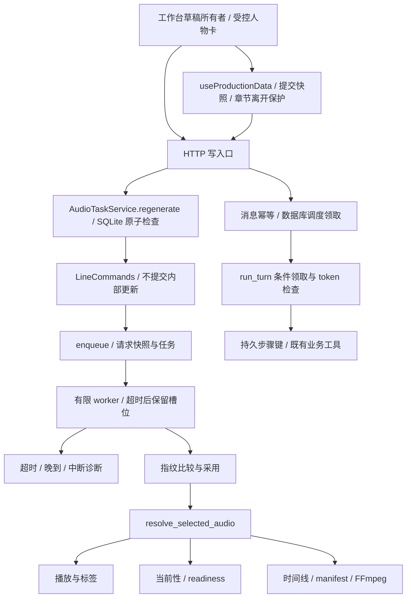

# 5a44ee7 后续复审：R1–R6 修复与验收

日期：2026-09-19。核对基线：`master@5a44ee7f42740c97d3b74335c17186c09f1fc817`。开始时没有已跟踪文件的未提交修改；原有未跟踪的产品资料、evals/audio_drama_v1、personal-site、reports 保持原位，不纳入本轮提交。

范围来自用户明确请求：复现并修复 R1–R6；附件是待核对的审阅意见，不据其推断运行结果，也不将 R7–R8 扩展成新一轮改造。保留技术栈、目录主干、真实数据和公开 Demo。所有模型测试使用固定 fake；本地 SQLite、配置、音频均为临时数据。

## 基线和失败证据

基线入口 `SonicVale/.venv/bin/python scripts/test_backend.py`：202 项通过，15.335 秒。`npm test --prefix sonicvale-front`：31 项通过，0 失败。新增回归先在原实现上运行，再修改生产代码。

| ID | 原实现中的失败证据 | 实施结果与兼容影响 |
| --- | --- | --- |
| R1 | HTTP 请求在已有活动任务时返回 200/旧 task；队列满返回 429 但指导已变成 B | `AudioTaskService.regenerate` 持有 SQLite 写事务，先检查活动任务，再通过 LineCommands 保存指导并冻结入队输入。活动任务一律 409，返回现有任务 ID/输入快照，新指导不落库。提交前发现队列已满也回滚。前端保留输入、显示实际执行指导。普通无冲突重生成保持 200；本轮重生成使用独立 task 历史。 |
| R2 | 两个独立 Session 同时进入 run_turn，规划执行 2 次；重复 HTTP 调度 2 次；中断无持久 turn 状态。额外复现领取失效后晚到计划仍会执行工具/最终总结调用 | schema 12 给 ChatMessage 增加 turn_status/turn_token。HTTP queued→scheduled 及 worker queued/scheduled→running 都通过条件 SQL 领取；规划/工具/最终总结边界检查 token，完成状态与回复同事务。工具键为 turn ID + 步骤。中断保留 pending_tool、已完成结果并标 interrupted，不自动重放。HTTP 返回同一 user_message_id 与 turn_status，消息历史可读中断状态。 |
| R3a | 挂载实际 ProjectWorkspace + RoleDraftConfirmCard，改音色和 selected 后同 revision 刷新，音色 9 被旧值 1 覆盖 | 工作台是唯一草稿所有者；人物卡只发显式修改事件，去掉双向 deep watch。同 revision 保留 dirty 草稿；新 revision 出现时保留本地并暂停确认，用户选择使用新版或保留本地。头像异步结果检查 session/revision。 |
| R3b | 挂载实际逐句组件，保存 A 期间输入 B，A 响应后编辑器变回 A | 发送前复制提交值，baseline 仅确认这份提交；刷新合并后编辑器仍为 B、baseline 为 A。 |
| R3c | 台本→配音→时间线→台本重建组件，未保存文字变回服务器原句 | 逐句草稿由工作台 provide 持有，仅缓存当前章节的数据，不缓存全部页面。切视图保留；切章节、离开路由、新建章节有明确放弃/留下提示；关闭窗口使用 beforeunload 提示。真正离开后才清理，另一章不继承草稿。刷新整个浏览器不会将草稿写入永久存储。 |
| R4 | created 会话经恢复仍为 created；角色生成失败后 resume 再调用解析器 | 启动把未开始会话标成可显式继续的 failed/retry(created)，不发模型请求。点击原有继续入口再执行；恢复角色生成复用 parsed_json。重复继续只解析一次。已有审查 checkpoint 未重写。 |
| R5 | 超时后没有失败通知，trace 停 preparing；停机/重启也遗留活动 trace | 超时立即记录 timed_out + running_after_timeout 并通知；槽位保留，底层结束记录 late_succeeded/late_failed，文件隔离、无采用版本。取消/重启记录 interrupted/unknown_after_shutdown。健康接口增加活动/阻塞槽位与 degraded 标志；历史记录显示超时和中断。CosyVoice 增加 180 秒完成等待上界。 |
| R6 | 处理文件缺失时播放 A，input_current 却按 B 返回 true；选中生成文件缺失、canonical 指向 B 时仍按 A 返回 false | `resolve_selected_audio` 同时解析 path、available、实际版本/处理版/源版本 ID 和 fallback_reason。播放、当前性、后期版本来源、时间线、导出 manifest、前端版本标签共用结果。保留“处理版→选中 take→canonical 路径”的回退顺序，不猜最后一个 take。缺失/不明确来源不冒认指纹。 |

R1 采用拒绝策略，因此提交 B 收到 409 后数据库仍是 A，A 完成仍可成为 **A** 的有效结果；不存在把 A 视作已接受 B 的结果。若用户通过普通编辑接口另行保存 B，原有指纹测试继续保证 A 只成为历史 take。

数据库提交和内存入队仍不是一个跨资源事务：沿用“先保存任务再入队”的可恢复设计；提交之后若入队异常，保留 `ENQUEUE_FAILED` 与指导供显式重试，不返回成功。

## 不重复修改与反证

- 旧参考音频检查和上传已经分别传入 `requests.get/post(..., timeout=30)`。新增 mock 传输测试通过，未重复改它们。
- 普通完整音频版本切换、旧输入生成结果隔离、手工时间线、初审/返修 checkpoint 等已有回归保持通过，未按审阅意见推倒重做。
- R6 的“处理文件存在且引用完整”对照用例在原实现即通过；只修复实际文件与来源推断分离的异常分支。
- HTTP 传输已有 120/180 秒超时、下载 120 秒；本机 Edge 库连接/接收默认 10/60 秒，Sambert 的已安装 DashScope WebSocket 使用 300 秒总超时。CosyVoice 的完成等待原来默认 None，已用 fake SDK 复现并补显式参数。socket 读超时不等于可强制终止线程，仍保留 worker 总等待超时、槽位占用和诊断；未声称所有底层代码都可取消。

## 验证命令和真实结果

```bash
# 每组均先运行新用例获得上述失败，再进行实现；以下是完成后的回归入口。
SonicVale/.venv/bin/python scripts/test_backend.py test_regeneration_entry test_generation_consistency
SonicVale/.venv/bin/python scripts/test_backend.py test_assistant_turn_concurrency test_production_assistant test_runtime_recovery test_migration_copy
node --experimental-default-type=module --test sonicvale-front/tests/workspace-editing.test.mjs
SonicVale/.venv/bin/python scripts/test_backend.py test_workflow_recovery
SonicVale/.venv/bin/python scripts/test_backend.py test_timeout_reconciliation test_worker_boundaries test_runtime_recovery
SonicVale/.venv/bin/python scripts/test_backend.py test_audio_resolution test_audio_variants test_timeline_service test_render_snapshot test_tts_engine_capabilities
./scripts/verify.sh
```

最终完整入口实测：220 项后端测试通过（12.485 秒）；36 项前端测试通过，0 失败；147 个 API 路由检查；隔离 API/真实 FFmpeg smoke；Electron main/preload/logger 语法检查；普通和静态 Demo 构建均为 4.01 秒。新增来源一致性测试实际渲染 WAV，并断言导出片段路径与源版本为 B；回退到旧输入 A 时，时间线来源仍为 A，并明确拒绝导出过期内容。构建仍有既有 >500 kB chunk warning，不作为本轮无关优化扩展。`git diff --check` 通过。

测试入口在导入数据库前设置临时配置，禁用 Python 外部网络。前端挂载测试使用 Vue 真实 SFC 编译、渲染器、父子 props、watch 与生命周期；只替换网络、路由和无关视觉组件。另有实际浏览器验证，不能把 Node 挂载测试误报成 DOM/视觉验收。

schema 12 只在临时库和合成旧库副本迁移：源文件 hash、历史音频路径/字节、外键完整性保持；迁移前未完成 Agent 消息的 pending_tool 保留并标 interrupted，不排队。旧的 schema 版本断言由 11 更新为 12，没有删测试。追加历史消息 fixture 后独立复跑 `test_migration_copy` 通过。

本机过程日志在 `/tmp/auralis-r1-r6-final-verify.log` 与 `/tmp/auralis-r*-red.log`，可能随系统清理消失；上面命令可重新验证当前实现。

## 浏览器验收

使用 `scripts/fake_workspace.py`（临时 SQLite/固定 fake LLM/TTS、对外连接被禁用）和前端 Vite `5175`，复用一个 Tabbit 任务。

```bash
# 终端 1
SonicVale/.venv/bin/python scripts/fake_workspace.py
# 终端 2：在 sonicvale-front 中运行
VITE_API_BASE_URL=http://127.0.0.1:18200 npm run dev -- --host 127.0.0.1 --port 5175 --strictPort
# 仓库根目录：同一任务，按此顺序
~/.local/bin/tabbit-cli nodejs --task auralis-followup --request-id full-flow --timeout-ms 60000 < scripts/browser_smoke.js
~/.local/bin/tabbit-cli nodejs --task auralis-followup --request-id editing --timeout-ms 60000 < scripts/browser_editing_smoke.js
```

实际确认：固定原文→人物确认→台本审查/确认→两句配音→重生成第二 take→切换旧 take→素材→10.1 秒、3 片段的 FFmpeg 成片。浏览器媒体会返回带 Content-Range 的 206；旧脚本只接受 200，首次因此失败。检查实际成片后完善验收脚本：同时验证 Range 头和完整文件 HTTP 200、RIFF/WAVE 文件头，不修改业务实现迎合测试。

额外实际页面验证通过：未保存草稿经声音编排再返回仍保留；新建章节提示选择留下，取消后文字仍在；PUT 保存 A 已在服务器完成但响应被受控延迟，此时输入 B，放行 A 响应后 B 仍在编辑器；明确放弃后才进入新章节。无 pageerror。不证明用户下载目录最终落盘，也不是听感或真实模型质量证据。

归档脚本已复跑：完整制作 `full-flow-range-checked`，7.829 秒、WAV 1,779,250 字节；编辑保护 `editing-fixture-navigation`，1.743 秒。后者第一次归档复跑停在空白页面，未执行编辑；只读确认后改为按临时接口查询固定测试章并显式导航，复跑通过。验收后临时后端、Vite 与 Tabbit 任务均已结束。

## 当前业务链



R7 的失败轮询退避/静态元数据请求量测量，以及 R8 的依赖审计分类和定向升级未纳入本轮 R1–R6 修复。真实供应商、真实历史数据库、打包 Electron、全系统进程强杀矩阵和人工听感验收仍未执行。当前已有故障注入、独立 Session 并发与真实浏览器工程闭环，不能外推为这些验收已完成。

## 基线远程验收补记

保留 [2026-09-16 本地记录](verification.md) 原始时点。2026-09-19 通过 GitHub API 核对：`5a44ee7` 的 [run 35402793962](https://github.com/rheeh/auralis/actions/runs/35402793962)、job `105786114344` 为 success，包含隔离测试、FFmpeg 和两个构建。上传代码与部署分开；本轮没有触发 Pages 或其他发布。
