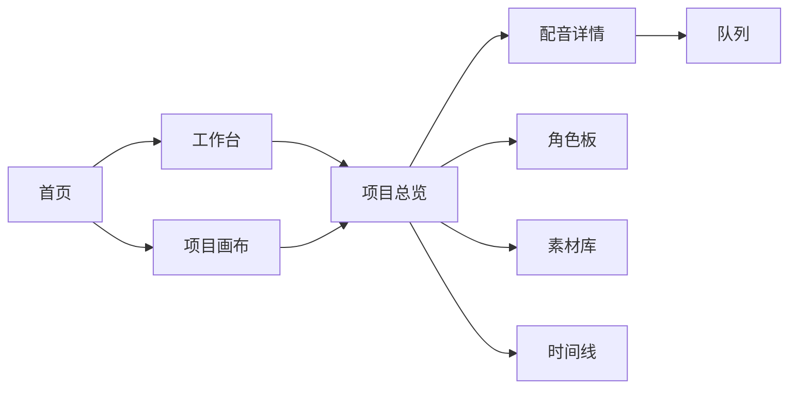
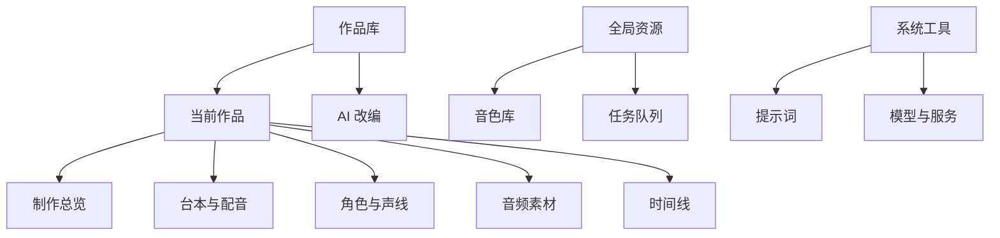
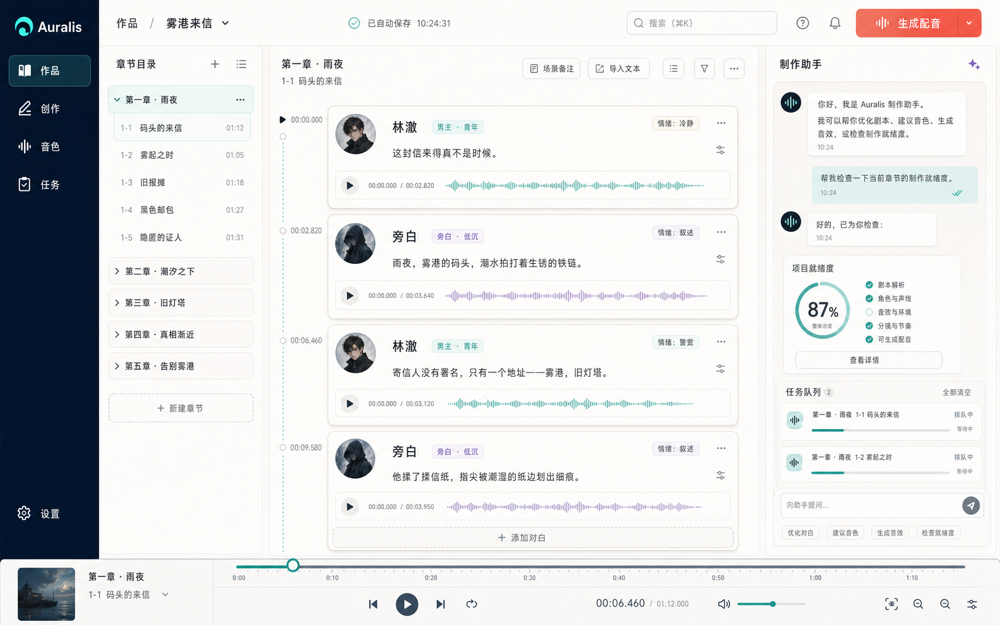

# Auralis 前端交互梳理与重构设计

> 依据 2026-07-11 当前仓库代码整理。实现范围以 `sonicvale-front/src` 为准，未假设尚不存在的后端能力。

## 1. 设计结论

Auralis 不应再像“功能入口集合”，而应像一个广播剧创作 IDE：用户先进入作品，再围绕同一作品连续完成改编、角色、配音、素材和时间线检查。AI 是随时可调用的制作助手，项目数据库仍是内容与生产状态的唯一事实来源。

新版采用三层结构：

1. **全局层**：作品、创作、音色、任务，以及提示词和设置。
2. **作品层**：制作总览、台本与配音、角色与声线、音频素材、时间线。
3. **内容层**：当前章节、台词、音频波形、生成状态和上下文操作。

## 2. 当前交互逻辑

### 2.1 现有入口

| 路由 | 页面 | 当前职责 | 主要问题 |
| --- | --- | --- | --- |
| `/home` | `Home.vue` | 产品介绍、配置提醒、最近项目、快捷入口 | 同时承担欢迎页、仪表盘和导航，进入产品后仍像营销页 |
| `/studio` | `Studio.vue` | 对话式/结构化小说改编 | “工作台”名称过宽，与项目制作页语义冲突 |
| `/projects` | `ProjectList.vue` | 新建项目、项目卡片、制作节点 | 项目卡片重复承载完整流程，信息密度过高 |
| `/projects/:id/overview` | `ProjectOverview.vue` | 项目状态、下一步、体检 | 是正确的项目入口，但此前没有稳定的项目内导航 |
| `/projects/:id/dubbing` | `ProjectDubbingDetail.vue` | 章节、台词、角色、音频、生成、导出 | 功能完整但体量很大，用户容易在工具和流程之间迷失 |
| `/roles` `/media` `/timeline` | 三个 Board 页面 | 项目角色、素材、时间线 | 以全局页面出现，实际却依赖 `project_id`，层级错位 |
| `/voices` | `VoiceManager.vue` | 全局音色资产 | 应保留为全局资源，这是跨作品复用能力 |
| `/queue` | `QueueBoard.vue` | 改编和音频任务 | 应保留为全局生产状态，同时从作品页提供上下文入口 |
| `/config` `/prompts` | 配置页面 | 模型、TTS、提示词 | 属于低频系统工具，不应与核心制作步骤同权展示 |

### 2.2 原有主路径

问题在于：`Studio`、`Projects`、`Overview` 和 `Dubbing` 都像“主工作台”，而角色、素材和时间线既是项目步骤又是全局入口，导致用户无法形成稳定心智模型。

## 3. 新信息架构

### 导航规则

- 默认入口从 `/home` 改为 `/projects`，打开应用后直接看到作品。
- 左侧栏只保留四个高频全局入口：作品、创作、音色、任务。
- 当 URL 中出现 `:id` 或 `project_id` 时，左侧栏自动展开当前作品导航。
- 顶部上下文栏只回答三件事：我在哪里、当前是什么作品、下一步最常用动作是什么。
- 设置与提示词沉到底部，降低它们对创作主流程的干扰。

## 4. 核心交互重新设计

### 4.1 新建作品

1. 在作品库点击“新建作品”。
2. 首屏只要求作品名和一句话备注。
3. LLM、TTS、提示词和路径放入“高级设置”，并自动采用可用默认值。
4. 创建后直接进入 AI 改编；若选择空白台本，则进入制作总览。

### 4.2 小说改编

1. 选择目标作品。
2. 输入章节标题、改编要求和原文。
3. 默认使用对话式改编，依次确认角色和剧本。
4. 写入后进入制作总览，而不是让用户自己寻找下一页。
5. 结构化一次生成保留为高级模式，但不与默认模式争夺注意力。

### 4.3 项目制作

1. 制作总览计算缺口，只给一个主要“继续制作”动作。
2. 台本与配音页围绕章节和台词工作，不再重复全局导航。
3. 角色、素材、时间线均在当前作品导航下切换，并持续携带 `project_id`。
4. 生成任务进入全局队列，但返回时恢复到原作品/会话。

### 4.4 状态反馈

- “本地自动保存”表示保存机制，不再硬编码“制作就绪”。
- 项目是否就绪由真实 readiness API 决定。
- 主按钮使用珊瑚色表示生产动作；薄荷色用于选中、完成和辅助状态。
- 错误、缺口、占位素材与完成状态保持不同语义，不只依赖颜色。

## 5. 视觉方向

视觉稿使用内置图像生成工具制作，属于高保真实现参考。代码实现采用同一原则：深墨色工具栏、暖白内容画布、薄荷色导航状态、珊瑚色主要生产动作、细边框与低阴影。

参考产品并非逐像素临摹，而是提取交互原则：

- [Oimi AI Studio](https://oimi.ai/zh)：无限画布与连续创作，核心对象位于中央。
- [UOUO](https://www.uouo.fun/)：结构化小说/剧本创作与资产持续沉淀。
- [轻语 TTS](https://qytts.com/)：把声音生产拆成输入、音色、生成、试听的短闭环。

## 6. 本次代码重构

### 已修改

- `sonicvale-front/src/App.vue`
  - 顶部平铺导航改为可收起的桌面 IDE 左侧栏。
  - 新增基于路由的当前作品导航与作品名称读取。
  - 新增稳定的上下文栏、项目体检和进入制作快捷动作。
  - 保留深浅主题并记忆侧栏状态。
- `sonicvale-front/src/router/index.js`
  - 根路由默认进入作品库。
- `sonicvale-front/src/pages/ProjectList.vue`
  - “项目画布”改写为用户可理解的“作品库”。
  - 统一新建作品、空白台本和最近作品的动作命名。
- `sonicvale-front/src/pages/Studio.vue`
  - 去掉营销式大图 Hero，改为紧凑的 AI 改编工具头部。
  - 明确默认“对话式改编”和高级“结构化快速生成”的关系。
- `sonicvale-front/src/style.css`
  - 建立统一字体、色彩、圆角、阴影和主操作色。

### 未改动的数据边界

- 仍复用现有 `src/api` 请求层。
- 仍由现有 projects / chapters / roles / lines 数据负责业务状态。
- 没有增加虚假的导出历史、实时协作或云端保存能力。
- 原有页面路由继续兼容，避免一次 UI 重构破坏已有深链接。

## 7. 验收标准

- 打开应用直接进入作品库。
- 四个全局入口始终稳定可见。
- 进入任意带作品 ID 的页面后，项目内五个步骤自动出现。
- 角色、素材、时间线切换时保留 `project_id`。
- 无项目时仍可进入 AI 改编和配置页面。
- 深浅主题、侧栏收起状态在刷新后保持。
- `npm run build` 成功；本地浏览器可渲染作品库和 AI 改编页且无前端运行错误。
