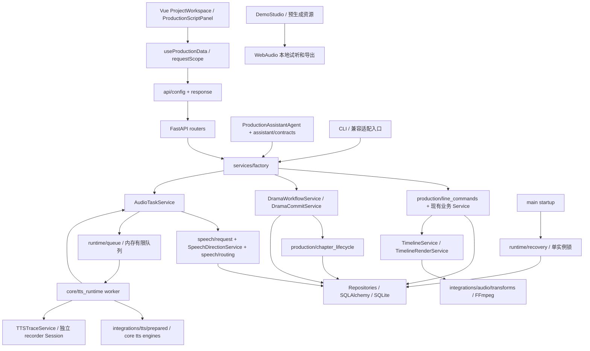

# Auralis 当前架构与业务调用链

当前事实来源，更新于 2026-09-16。基于 `master@5aed5b8391d848e7e7e1191c551caa882d5de82f` 加本次本地工作区改动；本次没有提交、推送或发布。旧地图保存在 [历史快照](history/project-map-before-reliability-2026-09-16.md)。产品范围见 [PROJECT](../PROJECT.md)，实施状态见 [BACKLOG](../BACKLOG.md)。

## 实际模块图

它仍是一个模块化单体，没有新增服务进程或分布式队列。未机械创建规格中的全部目标目录；低收益的旧路径保留。`main.py` 仍承担较多启动和默认数据初始化；工作流与助手主循环也仍在原 Service 文件内，不能把本轮称为全部模块已拆完。

## 权威写入与事务

| 用例 | 活跃调用链 | 状态归属 |
| --- | --- | --- |
| 修改文本/指导/角色/清空字段 | 页面 PUT / Agent `_update_line` → LineService.update_line → LineCommands.update | 同一次提交更新台词、场景待生成状态、时间线失效 |
| 类型转换 | type API → LineTypeService → 同一 LineCommands | 先校验/记录历史，保留 take/variants，清空当前选用 |
| 角色换音色 | role API / Agent → RoleService.update_role | 角色与受影响台词/时间线一起提交 |
| 选择 take / 后期版本 / 素材 | LineService 对应用例 → update_line | 源 take 关联、当前选择、时间线失效一起提交 |
| 旧原地音频处理 API | `/lines/process-audio/{id}` → process_audio → create_audio_variant | 改为独立后期版本，不改源文件 |
| 排序 | LineCommands.reorder | 同章节、正整数、唯一行/位置校验，短事务 |
| 提交改编 | chat commit / legacy commit_run → DramaCommitService | 条件 lease、前置阶段、新建/显式覆盖、写入事务 |
| 删除 | LineService / ChapterService / ProjectService | 活动任务拒绝；快照、外键解绑、数据库事务；文件保留或归档 |
| 编辑时间线 | timeline API → TimelineService.update_clip | 沿用已有手工编辑规则与校验 |

`LineUpdateDTO`/`LinePublicCreateDTO` 拒绝内部状态、输出路径和版本数组。更新使用 `exclude_unset`，未提供不改，明确 null 清空可空字段。旧 `LineCreateDTO` 暂保留为内部/生成兼容快照。`LineRepository.update(commit=False)` 供新命令使用，默认提交仍是旧调用兼容边界；未全局删仓储 commit。

并非所有历史写入口已完成同等事务归并，尤其旧导入路径和历史仓储兼容适配仍需审计，见 BACKLOG。测试用无 DB 的旧 repository stub 也仍由 LineService 兼容分支支持。

## 一次配音的真实调用链

1. API/Agent → AudioTaskService.enqueue。校验项目—章节—台词归属，读取当前数据库输入；不会相信外部 DTO 的状态/路径。
2. `prepare_request` 复用 SpeechDirectionService.prepare 与纯 voice routing，冻结实际文本、音色/供应商/模型、路由、情绪/强度/指导、上下文、项目设定修订、发音替换、供应商参数及参考音频摘要。
3. 对完整脱敏快照计算 SHA-256；不让日志的长度截断截掉指纹输入，API key 不参与。凭证仅留在进程内执行请求，不写入持久快照。
4. 一次 attempt 一个 token 和唯一 `audio/attempts/{line}-{token}.wav`。数据库先记录，再确认入队；入队失败有可恢复状态。SQLite 部分唯一索引限制每句一个活动 attempt。
5. worker 通过条件更新 claim，在自己的 Session 保存 trace；executor 接收普通 dict 和拥有独立 Session 工厂的 recorder，不持有业务 Session。
6. 成功后验证音频帧数，条件抢占完成权并重算当前指纹。匹配才选用/标 done；不匹配只追加历史 take，保留当前选择。
7. 提交后通知。通知/trace 收尾失败不反转已完成业务。超时不能杀死运行中的线程：标失败后继续占用该 worker 槽直到线程结束；晚到文件不会自动选用。

线程语义参考 [SQLAlchemy Session 隔离](https://docs.sqlalchemy.org/en/20/orm/session_basics.html#is-the-session-thread-safe-is-asyncsession-safe-to-share-in-concurrent-tasks) 和 [Python 3.12 Future 取消](https://docs.python.org/3.12/library/concurrent.futures.html#concurrent.futures.Future.cancel)。实际安装 SQLAlchemy 2.0.44 / Python 3.12.13，未为此升级框架。

## 状态与恢复

- `production/audio_state.generation_state` 分开 `has_audio`、`input_current`、`needs_generation` 和 selected IDs。供配置、批量生成、Agent、readiness 与时间线使用。无指纹旧 take 为 unknown，保持历史兼容，不伪造已追溯。
- 台词/指导改变保守失效同章同场景；项目表演设定改变保守失效本项目。有效 provider/声音改变还会在实时指纹比较时被识别。
- task 是执行历史；章节进度按当前台词适用性计算，`execution_progress` 单列执行进度。
- workflow lease 使用条件 SQL、token 与到期检查；外部调用返回后校验 lease。幂等键先于阶段校验，避免成功后的重试被错误拒绝。
- 初审、返修、返修后复审各保存 checkpoint。恢复不会重复已保存的前序模型调用。
- `runtime/recovery` 用配置目录单实例锁。启动将遗留队列/执行任务标为 PROCESS_INTERRUPTED，清除过期 lease；不自动重发。Agent 逐工具保存结果与 pending 标记，不确定中断需检查后显式处理。
- 事件序号使用 SQL 原子递增；阶段/checkpoint 与阶段事件同事务。其他历史发布点仍有先业务提交再记事件的路径，尚未全量合并。

## 音频和时间线

`audio_selection.selected_audio_path` 是播放、后期与时间线共同的当前选音规则。新文件独立，删除后期选择会保存元数据归档并保留文件；素材重新绑定保留旧 take 列表。

时间线沿用原有手工位置/增益/裁剪/淡入淡出规则。输入指纹包含台词、指导和选用源。渲染前冻结普通数据并释放数据库事务，WAV 与 manifest 来自同一冻结快照；渲染期间发生编辑时，旧成片会被当前性检查拒绝。每次混音使用唯一文件名。缺失/过期/占位素材通过现有阶段成片清单呈现。

`audioEvents` 能力表：

| 输入 | 当前行为 | 证据 |
| --- | --- | --- |
| `sound_library_placement` 及明确素材、anchor、offset、gain、fade、duration、loop | 确定性写入素材位置并影响实际时间线/FFmpeg | sound library/timeline tests + browser smoke |
| 情绪/声音指导 | 按 provider 能力发送原生指导或近似映射参数 | speech/scene/guidance tests；不证明真实听感 |
| 其他自然语言 `audioEvents`（如呼吸、回声、走远） | 仅保留制作备注，UI 标注未自动执行 | ProductionScriptPanel 的事件状态说明 |

## 前端与 Demo

`useProductionData` 拥有生产数据、配置、任务轮询与 dirty 草稿；`requestScope` 区分最新查询和操作上下文，章节切换/卸载使迟到响应失效。播放器仍在 ProductionScriptPanel，离开清理；SelectedTakeInfo 展示当前音频的生成文本/指导与适用性。ProjectWorkspace 的 session/history 使用 epoch 和请求 scope。确认/发送动作尚未全部提取为独立 composable。

`api/response` 统一 HTTP 错误与历史 `{code,message,data}`。普通请求默认 30 秒；同步 FFmpeg render 明确使用更长的独立上限，后台渲染 operation 化仍未做。静态 Demo 未实现端点与实时生成明确报错，DemoStudio 本身只使用预生成音频。

## 配置、启动和迁移

- AURALIS_CONFIG_DIR 决定配置与 `app_test.db`；开发脚本默认 `.local-data` 未改。测试先设临时目录再 import app/engine。
- frontend 地址来源：桌面 preload 的 `auralisRuntime`→ VITE_API_BASE_URL → 本地 8200。HTTP/媒体/旧 WebSocket 使用同一实例 token。
- `/health` 返回 Auralis 身份、API 版本、实际 schema、worker 和 FFmpeg 可用性。Electron readiness 检查身份/ready；安全开关恢复，IPC 检查主 frame、文件选择授权和大小，限制导航与新窗口。
- 当前 schema 11：9 增加 task 快照/token/指纹；10 增加 nullable provider_voice_id，只回填无歧义旧 description；11 建立活动任务唯一索引并标记升级前中断。
- `scripts/migrate_copy.py` 用 SQLite backup API 复制只读源到新文件，再迁移、integrity_check、foreign_key_check。已验收合成历史库；未打开用户真实库。
- 迁移后旧代码不能直接保证识别新增语义。回退应停服务、保留新产物、恢复经验证数据库备份；git revert 不是数据回滚。

## 入口保留情况

活跃：ProjectWorkspace、DemoStudio、FastAPI routers、services/factory、core/tts_runtime、dev.sh、verify.sh、Electron main/preload。兼容：`/studio`、旧 overview/dubbing 路由重定向；legacy adaptation commit 转同一 DramaCommitService；旧 process-audio 转版本创建；旧路径重命名 API 明确拒绝。

`ProjectDubbingDetail.vue`、`ChatProductionPanel.vue` 等历史文件保留，未因体积大删除。LineService 的旧同步供应商方法也仍保留测试/兼容消费者，生产 worker 已改用 prepared adapter；进一步缩减这些路径需要独立消费者审计。
