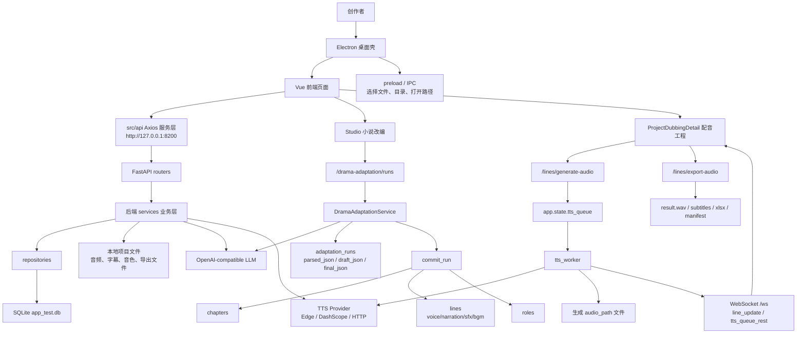

# AI 项目架构地图

## 项目概览

### 产品定位

Auralis 是一个本地优先的 AI 广播剧制作系统，基于开源项目 SonicVale 二次开发。它保留 SonicVale 的多角色配音、角色库、音色绑定、批量生成、FFmpeg 音频处理能力，并新增“小说改编为广播剧工程”的 Agent 工作流。产品形态是 Electron 桌面制作台，面向个人创作者把小说正文转成可制作、可配音、可导出的多轨广播剧工程。

### 核心功能

- 项目管理：创建广播剧项目，绑定 LLM Provider、TTS Provider、提示词和项目保存路径。
- 小说改编：在 Studio 工作台粘贴小说正文，经三阶段 Agent 生成广播剧工程 JSON。
- 章节管理：按项目维护章节文本，支持导入章节、LLM 拆分台词、第三方 JSON 导入。
- 角色管理：按项目维护角色，绑定默认音色、角色重要性、TTS 路由和 Edge 音色。
- 台词管理：维护台词顺序、角色、情绪、强度、音频路径、字幕路径和生成状态。
- 多轨制作：台词支持 `voice`、`narration`、`sfx`、`bgm` 四类轨道；音效/BGM 不进入 TTS。
- 音色管理：维护 TTS Provider 下的音色、参考音频、多情绪音色、导入导出和音频处理。
- 音频生成与处理：后台 TTS 队列生成语音，支持音频附加、裁剪、变速、变音量、字幕矫正。
- 导出系统：按章节导出音频、字幕、表格和制作清单；Demo 脚本可生成完整本地样例工程。
- 任务队列：展示 TTS 队列状态和广播剧改编运行记录，可将待制作脚本写回项目。

### 技术栈

前端与桌面端：

- Electron 37：桌面壳、后端进程启动、文件/目录选择、打开本地路径。
- Vue 3 + Vite 7：前端应用和开发服务器。
- Element Plus：组件库。
- Vue Router：Hash 路由。
- Axios：HTTP API 客户端。
- SortableJS：台词拖拽排序。
- WaveSurfer.js：波形/音频播放相关能力。
- localStorage：主题、初始化向导、播放偏好、局部队列和画布视图缓存。

后端：

- FastAPI + Uvicorn：HTTP API 和 WebSocket 服务。
- SQLAlchemy + SQLite：本地数据库。
- OpenAI Python SDK：OpenAI-compatible LLM 调用。
- edge-tts、DashScope、Requests：免费 Edge TTS、阿里云百炼/旧 TTS SDK 和通用 HTTP TTS。
- soundfile、numpy、FFmpeg：静音素材、音频处理和导出。
- openpyxl：导出台词表格。

运行与数据：

- 默认后端地址：`http://127.0.0.1:8200`
- 默认前端地址：`http://127.0.0.1:5173`
- 默认配置目录：`~/Auralis`
- Electron 开发模式本地数据目录：`.local-data`
- SQLite 数据库文件：`app_test.db`

## 目录结构

```text
.
├── README.md                         # 项目主说明，包含架构、启动、验证和使用路径
├── scripts/
│   ├── dev.sh                        # 安装/检查依赖并启动前后端
│   ├── seed_demo.py                  # 生成本地 Demo 广播剧工程
│   └── verify.sh                     # 后端语法、路由、Demo 写入、Electron 和前端构建验证
├── SonicVale/
│   ├── requirements.txt              # Python 后端依赖
│   └── app/
│       ├── main.py                   # FastAPI 入口、路由注册、数据库初始化、TTS worker 启动、WebSocket
│       ├── core/                     # 配置、LLM/TTS 引擎、音频处理、字幕、提示词、WebSocket、后台队列
│       ├── db/                       # SQLAlchemy engine、Session、Base 和 get_db 依赖
│       ├── models/                   # ORM 持久化模型
│       ├── dto/                      # 请求/响应 DTO
│       ├── entity/                   # 业务实体对象
│       ├── repositories/             # 数据库访问封装
│       ├── services/                 # 后端业务服务层
│       └── routers/                  # FastAPI 路由层
├── sonicvale-front/
│   ├── package.json                  # Electron/Vue/Vite 依赖和启动/打包脚本
│   ├── electron/
│   │   ├── main.js                   # Electron 主进程，检测/启动后端并创建窗口
│   │   ├── preload.js                # 渲染进程可用的安全桥接能力
│   │   └── logger.js                 # Electron 日志和编码处理
│   ├── src/
│   │   ├── App.vue                   # 应用壳、顶部导航、主题切换、router-view
│   │   ├── main.js                   # Vue 应用入口
│   │   ├── style.css                 # 全局样式
│   │   ├── router/                   # 页面路由配置
│   │   ├── api/                      # 前端 API 服务层，按后端资源拆分
│   │   ├── pages/                    # 业务页面
│   │   ├── components/               # 复用组件和初始化向导组件
│   │   ├── utils/                    # 小工具函数，如编码检测
│   │   └── assets/                   # 前端图片和提示音资源
│   ├── public/                       # Vite public 静态资源
│   └── resource/                     # Electron 打包资源、许可文件、图标
├── image/                            # 项目图片素材/说明图片
├── .local-data/                      # Electron 开发模式下的本地数据库、日志、项目音频、音色缓存
└── .verify-data/                     # verify.sh 使用的临时验证数据
```

### 前端 `src` 目录职责

- `src/api`：前端服务层。每个文件对应后端一组资源 API，例如项目、章节、台词、角色、音色、Provider、广播剧改编和队列状态。
- `src/components`：复用 UI 组件。当前包含 `WaveCellPro.vue` 和初始化设置向导组件。
- `src/pages`：页面级业务组件，是主要状态和交互逻辑所在位置。
- `src/router`：Vue Router Hash 路由定义。
- `src/utils`：工具函数，目前用于 UTF-8/GBK 文本解码。
- `src/assets`：页面图片、提示音等前端资源。
- `src/stores`：当前不存在。项目没有引入 Pinia/Vuex，跨页面数据主要来自后端 API，少量 UI 偏好使用 `localStorage`。
- `src/services`：当前不存在。前端的服务层职责由 `src/api` 承担。

### 后端服务目录职责

- `app/core`：基础能力，包括 `LLMEngine`、`TTSEngine`、`EdgeTTSEngine`、可配置云端 TTS、FFmpeg 路径、音频处理、提示词、WebSocket 管理和 TTS worker。
- `app/routers`：HTTP/WebSocket 接口入口，负责参数接收、依赖注入和响应包装。
- `app/services`：业务逻辑层，负责项目、章节、台词、角色、音色、Provider、提示词和广播剧改编。
- `app/repositories`：数据库 CRUD 封装。
- `app/models/po.py`：数据库表模型，定义项目、章节、角色、音色、台词、Provider、提示词、改编运行记录等核心数据。

## 核心业务模块

### 项目管理

前端入口：

- `sonicvale-front/src/pages/ProjectList.vue`
- `sonicvale-front/src/pages/Home.vue`
- `sonicvale-front/src/api/project.js`

后端入口：

- `SonicVale/app/routers/project_router.py`
- `SonicVale/app/services/project_service.py`
- `SonicVale/app/models/po.py` 中的 `ProjectPO`

职责：

- 创建、查询、更新、删除项目。
- 绑定 LLM Provider、TTS Provider、提示词和项目根路径。
- 计算项目准备状态，包括 Provider、角色音色、素材轨、可朗读台词音频、导出就绪度。
- 修复准备状态，例如同步音频状态或创建素材占位。
- 批量导入章节文本。

### 章节管理

前端入口：

- `sonicvale-front/src/pages/ProjectDubbingDetail.vue`
- `sonicvale-front/src/api/chapter.js`

后端入口：

- `SonicVale/app/routers/chapter_router.py`
- `SonicVale/app/services/chapter_service.py`
- `SonicVale/app/models/po.py` 中的 `ChapterPO`

职责：

- 按项目维护章节。
- 导入章节文本。
- 调用 LLM 将章节正文拆成结构化台词。
- 导出 LLM Prompt。
- 导入第三方 JSON 台词。
- 智能匹配角色和音色。

### 角色管理

前端入口：

- `sonicvale-front/src/pages/RolesBoard.vue`
- `sonicvale-front/src/pages/ProjectDubbingDetail.vue`
- `sonicvale-front/src/api/role.js`

后端入口：

- `SonicVale/app/routers/role_router.py`
- `SonicVale/app/services/role_service.py`
- `SonicVale/app/models/po.py` 中的 `RolePO`

职责：

- 按项目维护角色。
- 绑定默认音色。
- 维护角色重要性、TTS 路由和 Edge 音色。
- 为广播剧改编写入台词时自动创建角色。

### 台词生成

前端入口：

- `sonicvale-front/src/pages/Studio.vue`
- `sonicvale-front/src/pages/ProjectDubbingDetail.vue`
- `sonicvale-front/src/api/drama.js`
- `sonicvale-front/src/api/line.js`

后端入口：

- `SonicVale/app/routers/drama_adaptation_router.py`
- `SonicVale/app/services/drama_adaptation_service.py`
- `SonicVale/app/routers/line_router.py`
- `SonicVale/app/services/line_service.py`
- `SonicVale/app/models/po.py` 中的 `LinePO` 和 `AdaptationRunPO`

职责：

- Studio 调用广播剧改编 API，创建 `adaptation_runs`。
- 三阶段 Agent 流程：解析小说、生成台本、整理可播语言。
- 标准化输出 JSON，生成 scenes、characters、lines。
- 写入项目章节和台词。
- 为台词填充 `line_type`、`track`、`should_speak`、`scene_title`、`sound_prompt`、`voice_profile`、`production_note`。
- 对已有章节台词进行增删改、重排、生成状态更新。

### 音色管理

前端入口：

- `sonicvale-front/src/pages/VoiceManager.vue`
- `sonicvale-front/src/api/voice.js`
- `sonicvale-front/src/api/multiEmotionVoice.js`

后端入口：

- `SonicVale/app/routers/voice_router.py`
- `SonicVale/app/services/voice_service.py`
- `SonicVale/app/routers/multi_emotion_voice_router.py`
- `SonicVale/app/services/multi_emotion_voice_service.py`
- `SonicVale/app/models/po.py` 中的 `VoicePO` 和 `MultiEmotionVoicePO`

职责：

- 管理 TTS Provider 下的音色。
- 保存参考音频路径和音色描述。
- 导入/导出音色库 ZIP。
- 创建 Edge-TTS 常见音色样例。
- 复制音色和处理参考音频。
- 管理多情绪音色参考音频。

### 音频轨道

前端入口：

- `sonicvale-front/src/pages/TimelineBoard.vue`
- `sonicvale-front/src/pages/MediaBoard.vue`
- `sonicvale-front/src/pages/ProjectDubbingDetail.vue`
- `sonicvale-front/src/components/WaveCellPro.vue`

后端入口：

- `SonicVale/app/routers/line_router.py`
- `SonicVale/app/services/line_service.py`
- `SonicVale/app/core/tts_runtime.py`
- `SonicVale/app/core/audio_engin.py`

职责：

- 将台词按 `voice`、`narration`、`sfx`、`bgm` 四类轨道展示和制作。
- 人物声/旁白进入 TTS。
- 音效/BGM 被标记为素材轨，不进入 TTS，需要导入或制作音频素材。
- 保存每条台词的 `audio_path` 和 `subtitle_path`。
- 支持附加音频素材、处理音频和播放检查。
- TTS worker 根据角色、音色、情绪、强度生成音频并广播状态。

### 导出系统

前端入口：

- `sonicvale-front/src/pages/ProjectDubbingDetail.vue`
- `sonicvale-front/src/api/line.js`

后端入口：

- `SonicVale/app/routers/line_router.py`
- `SonicVale/app/services/line_service.py`
- `scripts/seed_demo.py`

职责：

- 按章节导出合成音频。
- 支持单条/整体导出参数。
- 导出字幕并支持拼音匹配矫正、LLM 字幕矫正。
- Demo 工程生成 `result.wav`、`all_lines.xlsx` 和 `production_manifest.json`。

## 数据流



## 页面关系

主路由：

- `/home` -> `Home.vue`：首页、最近项目和快捷入口。
- `/studio` -> `Studio.vue`：小说改编工作台。
- `/projects` -> `ProjectList.vue`：项目列表和项目创建。
- `/projects/:id/dubbing` -> `ProjectDubbingDetail.vue`：项目配音工程详情。
- `/config` -> `ConfigCenter.vue`：LLM/TTS Provider 配置中心。
- `/voices` -> `VoiceManager.vue`：音色库。
- `/roles` -> `RolesBoard.vue`：角色声线绑定。
- `/media` -> `MediaBoard.vue`：素材库。
- `/timeline` -> `TimelineBoard.vue`：多轨时间线。
- `/queue` -> `QueueBoard.vue`：任务队列和改编运行历史。
- `/prompts` -> `PromptManager.vue`：提示词管理。

主要跳转关系：

- 首页 `/home` 可进入项目列表 `/projects`、工作台 `/studio`、具体项目配音工程 `/projects/:id/dubbing`。
- 项目列表 `/projects` 可进入配置 `/config`、工作台 `/studio?project_id=:id`、配音工程 `/projects/:id/dubbing`。
- 工作台 `/studio` 完成改编后可跳到配音工程 `/projects/:id/dubbing`，也可跳到角色页 `/roles` 或素材页 `/media`。
- 配音工程 `/projects/:id/dubbing` 可跳到配置 `/config`、音色库 `/voices`、素材库 `/media`。
- 角色页 `/roles` 可跳回当前项目配音工程 `/projects/:id/dubbing`。
- 素材库 `/media` 和时间线 `/timeline` 可按当前项目/章节跳回配音工程。
- 队列页 `/queue` 可将改编运行记录写入项目，并跳到对应配音工程。

## 状态管理

### 全局状态

当前前端没有独立 `stores/` 目录，也没有 Pinia/Vuex。全局或跨页面状态主要来自三类来源：

- 后端数据库：项目、章节、角色、音色、台词、Provider、提示词、改编运行记录。
- 后端运行时：`app.state.tts_queue`、`app.state.tts_executor`、`app.state.tts_workers` 保存 TTS 队列和 worker 状态。
- 浏览器本地存储：主题、初始化向导、默认保存路径、播放偏好、局部 UI 视图状态。

### 持久化数据

- SQLite：默认保存在 `getConfigPath()/app_test.db`。开发模式下 Electron 会通过 `AURALIS_CONFIG_DIR` 把配置目录指向项目根下 `.local-data`。
- 项目文件：项目根路径来自 `ProjectPO.project_root_path`；改编写入时音频目录类似 `{project_root_path}/{project_id}/{chapter_id}/audio`。
- 音色资源：默认可写入配置目录下 `voices/edge-presets` 或用户选择的目录。
- Provider 快照：Provider 创建、更新、删除会写入 `backups/provider_config_snapshots.jsonl`，用于恢复误删或误覆盖的配置。
- 日志：后端写入 `getConfigPath()/app.log`。

### 前端缓存和偏好

- `sv_theme`：深浅色主题。
- `auralis_setup_default_storage`：初始化向导默认保存路径。
- `auralis_setup_skipped`：初始化向导跳过状态。
- `queue_{projectId}`：配音详情页局部任务队列恢复。
- `canvasViewKey()` 对应的键：配音详情页画布视图设置。
- `hidden_roles_{projectId}`：配音详情页隐藏角色。
- `playMode`：播放模式。
- `completionSoundEnabled`：完成提示音开关。

### 缓存策略现状

- API 数据没有统一客户端缓存层，每个页面按需拉取。
- TTS 进度通过 WebSocket 实时推送，页面刷新后可结合后端状态和局部 `localStorage` 恢复部分 UI。
- 音频播放 URL 通过版本号参数刷新缓存，避免音频文件更新后浏览器继续播放旧资源。

## API 与服务层

### 前端 API 模块

- `api/config.js`：Axios 实例，统一 `API_BASE_URL`、超时时间、响应解包和错误输出。
- `api/project.js`：项目 CRUD、项目准备状态、准备状态修复、章节批量导入。
- `api/chapter.js`：章节 CRUD、章节详情、LLM 拆分台词、Prompt 导出、第三方台词 JSON 导入、智能匹配角色音色。
- `api/line.js`：台词 CRUD、排序、生成音频、音频 URL、音频附加、音频处理、导出、字幕矫正。
- `api/drama.js`：广播剧改编运行创建、查询、列表、提交写入项目。
- `api/provider.js`：LLM/TTS Provider CRUD 和测试。
- `api/voice.js`：音色 CRUD、导入导出、Edge 预设、音频处理、复制音色。
- `api/role.js`：角色 CRUD 和按项目查询。
- `api/prompt.js`：提示词 CRUD、任务类型查询。
- `api/enums.js`：情绪和强度枚举查询。
- `api/multiEmotionVoice.js`：多情绪音色 CRUD。
- `api/queue.js`：TTS 队列状态查询。
- `api/setup.js`：初始化向导状态聚合、默认保存路径、Edge-TTS Provider 创建、Demo 项目创建。

### 后端 Router 模块

- `project_router.py`：项目 CRUD、准备状态检查/修复、批量导入章节。
- `chapter_router.py`：章节 CRUD、LLM 拆分、Prompt 导出、第三方 JSON 导入、智能角色音色匹配。
- `line_router.py`：台词 CRUD、批量排序、音频路径、素材附加、TTS 入队、音频处理、导出、字幕矫正。
- `drama_adaptation_router.py`：小说改编运行、运行记录列表/详情、提交写入项目。
- `role_router.py`：角色 CRUD。
- `voice_router.py`：音色 CRUD、导入导出、处理、复制、Edge 预设。
- `multi_emotion_voice_router.py`：多情绪音色 CRUD。
- `llm_provider_router.py`：LLM Provider CRUD 和测试。
- `tts_provider_router.py`：TTS Provider CRUD 和测试。
- `prompt_router.py`：提示词 CRUD 和任务类型。
- `emotion_router.py`、`strength_router.py`：情绪和强度枚举。
- `queue_router.py`：后端 TTS 队列状态。

### 后端 Service 模块

- `drama_adaptation_service.py`：三阶段 Agent 改编、JSON 解析/标准化、改编运行记录、章节/台词/角色写入。
- `project_service.py`：项目实体管理和项目保存路径初始化。
- `chapter_service.py`：章节业务、LLM 拆分台词、文本矫正、角色音色匹配相关逻辑。
- `line_service.py`：台词业务、音频生成、音频处理、素材附加、导出和字幕矫正。
- `voice_service.py`：音色业务、音色库导入导出、Edge 预设、音频处理。
- `role_service.py`：角色业务。
- `llm_provider_service.py`：LLM Provider 管理、测试和配置快照。
- `tts_provider_service.py`：TTS Provider 管理、默认 Provider 创建、测试和配置快照。
- `prompt_service.py`：提示词管理和默认提示词。
- `provider_backup_service.py`：Provider 配置快照写入。
- `emotion_service.py`、`strength_service.py`、`multi_emotion_voice_service.py`：枚举和多情绪音色管理。

### 核心引擎模块

- `core/llm_engine.py`：OpenAI-compatible 文本生成和 JSON 修复辅助。
- `core/tts_engine.py`：通用 TTS、Edge-TTS、可配置云端 TTS、DashScope CosyVoice/Sambert 支持。
- `core/tts_runtime.py`：后台 TTS worker，处理队列、跳过素材轨、广播进度。
- `core/audio_engin.py`：本地音频处理封装。
- `core/ws_manager.py`：WebSocket 连接管理和广播。
- `core/config.py`：配置目录和 FFmpeg 路径解析。
- `core/prompts.py`：默认提示词和 LLM Prompt 组装。

## 新对话快速阅读顺序

AI 重新接手项目时建议先读这 5 个文件：

1. `README.md`：项目目标、主架构、新增能力、启动、验证和使用路径。
2. `sonicvale-front/src/router/index.js`：前端页面地图和主要业务入口。
3. `SonicVale/app/main.py`：FastAPI 应用入口、数据库初始化、路由注册、TTS 队列和 WebSocket。
4. `SonicVale/app/models/po.py`：核心数据模型，理解项目、章节、角色、音色、台词和改编运行记录的关系。
5. `SonicVale/app/services/drama_adaptation_service.py`：小说改编为广播剧工程的核心流程和写入逻辑。

如果任务涉及配音工程页面，再优先补读：

- `sonicvale-front/src/pages/ProjectDubbingDetail.vue`
- `SonicVale/app/routers/line_router.py`
- `SonicVale/app/services/line_service.py`

如果任务涉及桌面启动或本地路径，再补读：

- `sonicvale-front/electron/main.js`
- `sonicvale-front/electron/preload.js`
- `SonicVale/app/core/config.py`

## 当前开发阶段

### 已经完成

- Electron + Vue + FastAPI 的本地桌面应用骨架。
- Electron 开发模式下检测/复用后端，必要时启动 `SonicVale/.venv/bin/python -m uvicorn app.main:app`。
- FastAPI 路由注册、SQLite 初始化、基础字段迁移和默认数据初始化。
- 项目、章节、角色、音色、Provider、提示词、情绪、强度等基础 CRUD。
- Studio 小说改编入口。
- 三阶段广播剧 Agent 服务：解析小说、生成台本、整理可播语言。
- 改编运行记录 `adaptation_runs`。
- 广播剧台词扩展字段：`line_type`、`track`、`should_speak`、`scene_title`、`sound_prompt`、`voice_profile`、`production_note`。
- 将改编结果写入章节、台词和角色。
- 项目准备状态检查和修复接口。
- TTS Provider 兼容配置：Edge、DashScope CosyVoice、DashScope Sambert、通用 HTTP。
- TTS 后台队列、worker 和 WebSocket 进度推送。
- 素材轨跳过 TTS 的处理逻辑。
- 音色库导入导出、Edge 预设音色、多情绪音色和参考音频处理。
- 多页面工作区：Home、Studio、Projects、Config、Voices、Roles、Media、Timeline、Queue、Prompts、ProjectDubbingDetail。
- 本地 Demo 工程生成和验证脚本。

### 进行中或已有雏形

- 前端工作台和配音工程的制作流程整合已经存在，但主要状态仍在页面组件内维护。
- 多轨时间线、素材库和项目准备状态已有页面和接口，仍偏检查/辅助制作形态。
- Queue 页面已能读取 TTS 队列和改编运行历史，但更完整的任务管理、失败重试和跨页面队列恢复还可继续加强。
- Provider 配置已有快照机制，但 UI 侧的恢复/版本管理能力还不是独立完整模块。
- 本地导出链路已经存在，Demo 能生成结果文件；正式导出的清单、素材完整性和多轨混音能力仍可继续产品化。

### 待实现或建议补强

- 建立正式前端状态管理层，例如 Pinia，把项目选择、章节选择、Provider 快照、队列状态和播放偏好从页面组件中抽出。
- 将前端 API 错误处理、加载状态、重试和消息提示统一封装。
- 为 `docs/` 补齐 `architecture.md`、`system-design.md` 或更细的后端/前端模块文档。
- 增加端到端测试或关键页面的交互回归测试。
- 增加数据库迁移管理工具，替代 `main.py` 中手写字段迁移。
- 完善素材轨制作能力，例如 SFX/BGM 素材生成、检索、替换、混音和版权来源记录。
- 完善导出系统的多轨混音、导出预检、失败原因解释和导出历史。
- 加强 Provider API Key 的本地加密或安全存储策略。
- 拆分过大的页面组件，尤其是配音工程详情页，降低维护成本。
