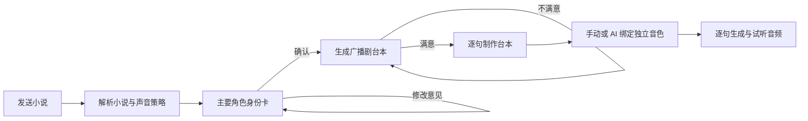

# Auralis 单页项目工作台设计

## 结论

项目是唯一制作上下文。用户点击或新建项目后进入 `/projects/:id/workspace`，后续不再跳转总览、角色板、配音详情或独立音频页。

页面固定分为两栏：

- 左侧：与 Auralis 制作助手对话，提交小说、修改人物或台本。
- 右侧：当前阶段的真实输出，依次显示人物身份卡、广播剧台本、逐句音色与音频。

## 为什么台本、音色和音频必须合并

最终生产单位不是“角色页”或“音频页”，而是一句台本：

```text
一句台本 = 一个说话角色 = 一个角色音色 = 一个音频结果
```

音色仍绑定在角色层，确保同一人物在全部台词中一致；界面则将角色音色投影到每句台词旁边。用户修改某个角色的音色后，同一角色的所有台词立即显示新音色，并提示重新生成音频。

## 工作流



人物身份卡应在台本之前确认。需要锁定的信息包括身份、动机、关系、性格、说话方式和声音方向。这样台本生成与后续音色选择共享同一个人物事实，不会分别漂移。

## Multi-Agent 边界

不建议让每个按钮都成为一个 Agent。当前适合三个专职 Agent：

1. **小说解析与声音策略 Agent**：七类句子分类，决定对白、SFX、BGM、静默、必要旁白或删除。
2. **角色设定 Agent**：生成人物身份卡，接收用户确认和修改。
3. **台本与声音审校 Agent**：生成分场台本，检查旁白比例、连续旁白和声音替代。

以下步骤使用确定性服务，不交给 Agent 自由控制：

- 项目、章节、角色和台词写入数据库。
- 角色音色唯一性校验。
- 音频任务入队、重试、进度和试听。

这使 Agent 负责创意判断，业务服务负责不可破坏的生产约束。

## 音色唯一性

- 自动绑定必须为每个实际可朗读角色分配不同音色。
- 音效和 BGM 不参与人物音色分配。
- 可用音色少于角色数量时直接阻断，提示补充音色库。
- 即使模型返回重复或不存在的音色，后端也会用尚未使用的有效音色补齐。
- 手动选择时，已经被其他角色占用的音色不可再次选择。

## 兼容策略

- `/projects/:id/overview` 自动重定向到项目工作台。
- `/projects/:id/dubbing` 自动重定向到项目工作台。
- 旧页面源码暂时保留，但不再进入主路由，避免一次删除影响历史逻辑核查。
- 项目列表、新建项目和最近项目统一进入项目工作台。

## 验收标准

- 点击项目后 URL 为 `/projects/:id/workspace`。
- 新建项目后直接进入同一路由。
- 左侧对话和右侧输出同时存在。
- 人物确认发生在台本生成之前。
- 台本不满意时可在左侧直接提交修改意见。
- 台本确认后自动进入逐句制作，不再打开新页面。
- 每句可朗读台词同行显示角色、文本、音色、生成状态和音频播放器。
- 自动和手动绑定都不能让两个角色共用同一音色。
- 旧总览/配音链接自动回到统一工作台。
